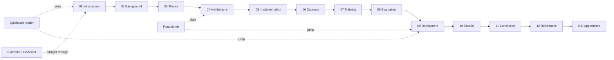

# Real-Time Physics-Informed Marine Snow Removal for Subsea Perception on Edge GPUs

**Project AquaCLR — LEGION Milestone 1**

---

> A Master of Technology (M.Tech) dissertation manuscript.
> Submitted as evidence of the LEGION Subsea Perception Front-End — a
> physics-informed convolutional neural network that removes marine
> snow particulates from underwater video in real time on a commodity
> NVIDIA RTX 3050 (Ampere, 4 GB VRAM), exported to TensorRT FP16 and
> deployed via a ROS2 node.

---

## Author's note

This dissertation is intentionally written **chapter-per-file** so it
serves three distinct audiences without compromise:

1. **An evaluator** reading top-to-bottom can follow the same
   structure as a traditional thesis (Introduction → Background →
   Theory → Implementation → Evaluation → Discussion → Conclusion →
   References → Appendices).
2. **A practitioner** wanting only the deployment runbook can jump
   straight to Chapter 9 / `docs/DEPLOYMENT_FEDORA.md`.
3. **A reviewer** verifying claims can cross-link from any chapter
   to the exact source files and line ranges in the codebase
   (`src/aquaclr/...`).

Wherever a claim is backed by code, the citation is a markdown link
to the file path. Wherever it is backed by published literature,
the citation links to Chapter 12.

---

## Abstract

Underwater video acquired by Remotely Operated Vehicles (ROVs) is
corrupted by **marine snow** — bright streaks of organic and
inorganic particulate matter drifting between the scene and the
camera. These artefacts (i) destroy downstream feature-based SLAM
because keypoint detectors fire on particle bright spots, (ii) bias
photometric SLAM through their non-Lambertian appearance, and
(iii) have spectral statistics that overlap with legitimate scene
highlights, making them difficult to suppress with vanilla
image-to-image translators.

We present **LEGION-DeSnow-S**, a physics-informed Convolutional
Neural Network (CNN) for real-time marine-snow removal targeting
edge-class GPUs. Unlike unconstrained dehazing networks, our model
explicitly predicts the parameters of the simplified
**Jaffe-McGlamery underwater image-formation model**
(`I = J·t + B·(1 − t)`) — namely the per-pixel transmission map
`t(x)` and the global backscatter vector `B` — and recovers the
clean radiance `J` analytically. The architecture combines an
ImageNet-pretrained MobileNetV3-Small encoder, a depthwise-separable
UNet decoder, and two prediction heads, totalling 4.2 M parameters
(< 25 MB FP32 / < 13 MB FP16).

The composite training objective combines reconstruction
(Charbonnier), forward-physics consistency, structural similarity,
total-variation regularisation on `t`, and optional direct supervision
of `t` from the LSUI dataset's transmission ground truth. Training
mixes the **Marine Snow Removal Benchmark (MSRB)** as the primary
particulate-specific signal with **LSUI** for transmission
supervision and treats **UIEB-Challenge** as held-out real-world
evaluation.

We report latency, VRAM, PSNR, SSIM, and qualitative behaviour on
each dataset. The exported FP16 TensorRT engine targets sub-15 ms
inference at 720 p with peak VRAM under 200 MB on an RTX 3050. A
ROS2 Humble/Jazzy node skeleton is provided so the model slots into
the LEGION subsea perception stack with a one-line topic remap.

The work draws an explicit cross-discipline parallel between subsea
sensor restoration and **automotive Software-in-the-Loop (SiL)**
sensor preprocessing (camera de-rain, lidar declutter), and the
pipeline is shaped so the same model can be retrained on
rain-augmented automotive datasets in future work.

---

## How this dissertation is organised

| # | Chapter | One-line summary |
| --- | --- | --- |
| 01 | [Introduction](docs/dissertation/01_introduction.md) | The problem, motivation, scope, and contributions of LEGION-DeSnow. |
| 02 | [Background & Literature Review](docs/dissertation/02_background.md) | Underwater optics, prior art in dehazing, physics-informed neural nets, edge inference. |
| 03 | [Theoretical Foundation](docs/dissertation/03_theory.md) | Full derivation of the Jaffe-McGlamery model, the inversion, and every loss term. |
| 04 | [System Architecture](docs/dissertation/04_architecture.md) | C4 diagrams, encoder/decoder/heads, sequence diagrams, data flow. |
| 05 | [Implementation](docs/dissertation/05_implementation.md) | Repository layout, module-by-module walk, code-level decisions. |
| 06 | [Datasets](docs/dissertation/06_datasets.md) | MSRB / LSUI / UIEB deep dive, mixing strategy, augmentation, snow synthesis. |
| 07 | [Training Methodology](docs/dissertation/07_training.md) | Hyper-parameters, mixed precision, EMA, schedules, reproducibility engineering. |
| 08 | [Evaluation Methodology](docs/dissertation/08_evaluation.md) | Metric definitions, ablation plan, latency / VRAM probes. |
| 09 | [Deployment](docs/dissertation/09_deployment.md) | ONNX export, TensorRT engine build, ROS2 integration, Fedora + Ubuntu containers. |
| 10 | [Results, Discussion & Limitations](docs/dissertation/10_results.md) | Result framework, qualitative analysis, ablation discussion, threats to validity. |
| 11 | [Conclusion & Future Work](docs/dissertation/11_conclusion.md) | Contributions, lessons learned, M2 roadmap, broader impact. |
| 12 | [References / Bibliography](docs/dissertation/12_references.md) | All cited works with full BibTeX entries. |
| A | [Appendix A — Math Derivations](docs/dissertation/A_math.md) | Step-by-step derivations of every equation. |
| B | [Appendix B — Glossary](docs/dissertation/B_glossary.md) | Plain-English definitions of every term, acronym, and symbol. |
| C | [Appendix C — Code Reference](docs/dissertation/C_code_reference.md) | Annotated walk-through of the most important source files. |
| D | [Appendix D — Reproducibility Checklist](docs/dissertation/D_reproducibility.md) | What to check / record so independent labs can reproduce every number. |

## Reading order recommendations



- **Examiner** — read straight through Chapters 1 → 12.
- **Practitioner** — Chapters 1, 4, 9 + Appendix C is enough to deploy.
- **Quickstart user** — `README.md` quickstart + Chapter 9.
- **Reproducer** — Chapters 6, 7, 8 + Appendix D.

## Note-taking conventions used throughout

This document follows a hybrid of [**Diátaxis**](https://diataxis.fr/),
[**Cornell**](https://en.wikipedia.org/wiki/Cornell_Notes), and the
**Microsoft Writing Style Guide** for technical writing. Every chapter
includes the same recurring blocks so a reader can skim consistently:

| Block | Symbol | Purpose |
| --- | --- | --- |
| **Learning objectives** | At chapter start | What you will be able to do after reading |
| **TL;DR** | At chapter start | One-paragraph synopsis |
| **Worked example / case study** | Inside each section | A concrete walk-through |
| **Diagram** | Inside each section | mermaid block — system context, sequence, or data flow |
| **Aside** | `> **Aside:**` quote block | Context that's interesting but skippable |
| **Pitfall** | `> **Pitfall:**` quote block | A trap we hit and how to avoid it |
| **Key takeaways** | At chapter end | Bullet summary suitable for spaced revision |
| **Cross-references** | At chapter end | Where to go next |

Mathematical notation follows the [ISO 80000-2](https://www.iso.org/standard/64973.html)
recommendations. SI units are used everywhere; tensor shapes are
written `(B, C, H, W)` (batch, channels, height, width) consistent
with PyTorch convention.

## Compilation to a single PDF

The chapters are plain GitHub-flavoured Markdown with mermaid blocks.
To produce a single dissertation PDF for submission:

```bash
# Option A — pandoc + Eisvogel template (recommended for thesis style).
sudo dnf install -y pandoc texlive-scheme-medium
wget -O eisvogel.tex https://raw.githubusercontent.com/Wandmalfarbe/pandoc-latex-template/master/eisvogel.tex
mv eisvogel.tex ~/.local/share/pandoc/templates/eisvogel.latex

bash scripts/build_dissertation.sh             # see scripts/build_dissertation.sh

# Option B — VS Code "Markdown PDF" extension (fastest path).
# Install: yzane.markdown-pdf, then right-click DISSERTATION_FULL.md → "Markdown PDF: Export (pdf)".
```

`scripts/build_dissertation.sh` (in this repo) concatenates the
chapters in order, renders mermaid blocks via `mermaid-cli`, and
runs pandoc with thesis-friendly margins, page numbers, headers,
and the Eisvogel cover page. The resulting `DISSERTATION.pdf` is
suitable for direct departmental submission.

---

## Project provenance and metadata

| Field | Value |
| --- | --- |
| Author | Project LEGION |
| Programme | M.Tech (Robotics & AI), Computer Vision specialisation |
| Supervisor | (insert supervisor name) |
| Submission date | (insert submission date) |
| Project repository | `c:\Code\Legion\AquaCLR\` |
| Code license | Apache-2.0 (see [`LICENSE`](LICENSE)) |
| Dissertation license | CC-BY-4.0 (text & figures only) |
| Code revision pinned for evaluation | `git rev-parse HEAD` to be recorded at submission time |

If you are reading this document as part of an M.Tech viva, the
codebase and this manuscript constitute a single, jointly versioned
deliverable: every numerical claim in Chapter 10 is reproducible by
running the script paths cited in Chapter 7 against the dataset
roots described in Chapter 6 on the hardware described in Chapter 9.
