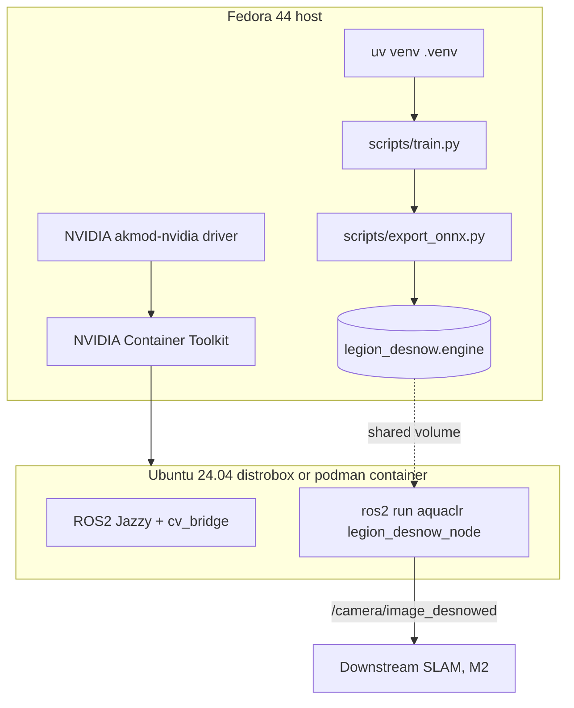

# Deploying AquaCLR on Fedora 44 + Ubuntu 24.04 ROS2 Container

This is the canonical end-to-end runbook for the **Project LEGION reference
deployment**: a Fedora 44 host running training + TensorRT natively, with
ROS2 served from an Ubuntu 24.04 LTS container provisioned via
`distrobox` + `podman` and full NVIDIA passthrough.

> **ROS2 release pairing (important):**
> Ubuntu 24.04 LTS → **ROS2 Jazzy Jalisco** (LTS, May 2024 → May 2029).
> Ubuntu 22.04 LTS → **ROS2 Humble Hawksbill** (LTS, May 2022 → May 2027).
> AquaCLR's `ros2_node.py` is API-compatible with both because it only
> uses the stable `rclpy.Node`, `cv_bridge`, and `sensor_msgs/Image`
> subset. Pick the distro that matches your container.

---

## Table of contents

1. [Architecture of the deployment](#1-architecture-of-the-deployment)
2. [Fedora 44 host preparation](#2-fedora-44-host-preparation)
3. [NVIDIA driver + Container Toolkit](#3-nvidia-driver--container-toolkit)
4. [Native install (training + TensorRT)](#4-native-install-training--tensorrt)
5. [Ubuntu 24.04 + ROS2 Jazzy distrobox](#5-ubuntu-2404--ros2-jazzy-distrobox)
6. [Running the ROS2 node](#6-running-the-ros2-node)
7. [Pure-podman alternative (no distrobox)](#7-pure-podman-alternative-no-distrobox)
8. [Verifying the full pipeline](#8-verifying-the-full-pipeline)
9. [Troubleshooting](#9-troubleshooting)

---

## 1. Architecture of the deployment



| Concern | Where it runs | Why there |
| --- | --- | --- |
| Training, ONNX export, TensorRT engine build | **Fedora host (native)** | Fast iteration, direct access to all Python tooling, easy IDE integration. NVIDIA + CUDA on Fedora is rock-solid via RPMFusion + PyTorch's bundled `cu124` runtime. |
| ROS2 node | **Ubuntu 24.04 container (Jazzy)** | ROS2 has no first-class Fedora packages. Jazzy ships only as `.deb`s; building from source on Fedora is a multi-day yak shave. A container is the correct solution. |
| Engine artefact (`.engine`) | **Shared volume between host and container** | Built on the host, consumed in the container. The `.engine` is portable as long as the GPU + driver match. |

## 2. Fedora 44 host preparation

```bash
# 2.1 Toolchain + headers needed by some Python wheels.
sudo dnf install -y \
    git curl wget gcc gcc-c++ make cmake \
    python3 python3-devel python3-pip \
    mesa-libGL libglvnd-glx \
    ffmpeg-free \
    @development-tools

# 2.2 Container stack: podman + distrobox.
sudo dnf install -y podman distrobox

# 2.3 uv (the project uses it for env + locking).
curl -LsSf https://astral.sh/uv/install.sh | sh
echo 'export PATH="$HOME/.local/bin:$PATH"' >> ~/.bashrc
source ~/.bashrc
uv --version          # should print 0.4.x or newer
podman --version
distrobox --version
```

## 3. NVIDIA driver + Container Toolkit

### 3.1 Host driver via RPMFusion

```bash
sudo dnf install -y \
    https://download1.rpmfusion.org/free/fedora/rpmfusion-free-release-$(rpm -E %fedora).noarch.rpm \
    https://download1.rpmfusion.org/nonfree/fedora/rpmfusion-nonfree-release-$(rpm -E %fedora).noarch.rpm
sudo dnf install -y akmod-nvidia xorg-x11-drv-nvidia-cuda
sudo akmods --force         # build the kernel module against the running kernel
sudo systemctl reboot
```

After reboot:

```bash
nvidia-smi                  # must list the RTX 3050 + driver version
```

### 3.2 NVIDIA Container Toolkit for podman

This is what lets containers see `/dev/nvidia*` cleanly through CDI
(Container Device Interface), which is the supported model on
Fedora + podman.

```bash
# Add NVIDIA's container repo.
curl -s -L https://nvidia.github.io/libnvidia-container/stable/rpm/nvidia-container-toolkit.repo | \
    sudo tee /etc/yum.repos.d/nvidia-container-toolkit.repo

sudo dnf install -y nvidia-container-toolkit

# Generate the CDI spec describing the host's GPUs.
sudo nvidia-ctk cdi generate --output=/etc/cdi/nvidia.yaml
ls /etc/cdi/                # should contain nvidia.yaml
```

### 3.3 Verify GPU access from a container

```bash
podman run --rm --device nvidia.com/gpu=all \
    docker.io/nvidia/cuda:12.4.1-base-ubuntu22.04 nvidia-smi
```

If this prints your GPU table, you're done with the hardest part. If
not, see [Troubleshooting](#9-troubleshooting).

> **Rootless vs rootful:** podman defaults to rootless on Fedora.
> `nvidia-ctk cdi generate` writes a system-level CDI spec that's
> visible to both rootless and rootful containers, so this works
> without `sudo podman`.

## 4. Native install (training + TensorRT)

```bash
# 4.1 Clone (replace with your remote / mounted path).
git clone <your-remote-or-path> aquaclr
cd aquaclr

# 4.2 Pinned virtual env.
uv venv .venv --python 3.11
source .venv/bin/activate

# 4.3 Core + dev tools.
uv sync --extra dev

# 4.4 Linux-only inference extras: ONNX, onnxruntime-gpu, TensorRT, PyCUDA.
uv sync --extra dev --extra trt
```

If `pip install tensorrt` from PyPI rejects your platform (it sometimes
does on bleeding-edge distros), fall back to NVIDIA's RPM repo. The
Fedora 39 repo is binary-compatible with Fedora 44:

```bash
sudo dnf install -y \
    https://developer.download.nvidia.com/compute/cuda/repos/fedora39/x86_64/cuda-fedora39.repo
sudo dnf install -y tensorrt python3-libnvinfer
```

### 4.4 Smoke tests

```bash
uv run pytest -q -m "not gpu and not trt"      # CPU suite
uv run python -c "import torch; print(torch.cuda.is_available(), torch.cuda.get_device_name(0))"
uv run python scripts/export_onnx.py --smoke   # tiny ONNX export, no GPU required
```

### 4.5 Train, evaluate, export

```bash
# Training (auto-detects the GPU and uses bf16-mixed).
uv run python scripts/train.py data=msrb

# Evaluation on MSRB-test.
uv run python scripts/evaluate.py \
    --ckpt outputs/<run>/ckpts/best.ckpt \
    --data-root data/msrb --split test --task 1

# ONNX + TensorRT engine + 200-iter benchmark at 720p.
uv run python scripts/export_onnx.py \
    --ckpt outputs/<run>/ckpts/best.ckpt \
    --out outputs/legion_desnow.onnx \
    --height 720 --width 1280 \
    --build-trt --benchmark
```

You should see output like:

```
INFO | aquaclr.bench | Benchmark | p50=8.4ms  p95=10.1ms  mean=8.7ms  FPS=114.9  peak_vram=137.2MB  n=200
```

The `.engine` artefact lives at `outputs/legion_desnow.engine` — that
is what the ROS2 container will consume.

## 5. Ubuntu 24.04 + ROS2 Jazzy distrobox

`distrobox` is the most ergonomic way to run Linux distros side by side
on Fedora. It mounts your home directory into the container, forwards
the GPU automatically when the host is configured per §3, and lets
you `ros2 run ...` exactly as if you were on Ubuntu.

### 5.1 Create the box (one-time)

```bash
distrobox-create \
    --name legion-ros2 \
    --image docker.io/library/ubuntu:24.04 \
    --nvidia \
    --additional-packages "curl gnupg lsb-release software-properties-common locales"
```

Flags worth knowing:

| Flag | Effect |
| --- | --- |
| `--nvidia` | Wires the host's NVIDIA driver into the container via CDI. Requires §3 to be done. |
| `--name` | The box name you'll use with `distrobox-enter`. |
| `--image` | Any OCI image. We pick the official `ubuntu:24.04` to align with ROS2 Jazzy. |
| `--additional-packages` | Pre-installed inside the box on first launch. |

> If you want **Humble** instead (Ubuntu 22.04), swap `ubuntu:24.04` for
> `ubuntu:22.04` and replace `jazzy` with `humble` everywhere below.

### 5.2 Enter the box

```bash
distrobox-enter legion-ros2
```

You're now in Ubuntu 24.04 with your `$HOME` mounted, including the
`aquaclr/` checkout. The first time you enter, the additional
packages will install — give it ~30 seconds.

### 5.3 Install ROS2 Jazzy (inside the box)

```bash
# Locale (Jazzy install requires UTF-8).
sudo locale-gen en_US en_US.UTF-8
sudo update-locale LC_ALL=en_US.UTF-8 LANG=en_US.UTF-8
export LANG=en_US.UTF-8

# Add the ROS2 apt repo.
sudo apt-get update && sudo apt-get install -y software-properties-common curl
sudo add-apt-repository -y universe

sudo curl -sSL https://raw.githubusercontent.com/ros/rosdistro/master/ros.key \
    -o /usr/share/keyrings/ros-archive-keyring.gpg
echo "deb [arch=$(dpkg --print-architecture) signed-by=/usr/share/keyrings/ros-archive-keyring.gpg] http://packages.ros.org/ros2/ubuntu $(. /etc/os-release && echo $UBUNTU_CODENAME) main" | \
    sudo tee /etc/apt/sources.list.d/ros2.list > /dev/null

sudo apt-get update
sudo apt-get install -y \
    ros-jazzy-ros-base \
    ros-jazzy-cv-bridge \
    ros-jazzy-sensor-msgs \
    ros-jazzy-image-transport \
    python3-rosdep \
    python3-colcon-common-extensions \
    python3-pip python3-venv

sudo rosdep init || true
rosdep update

# Persist the ROS2 sourcing.
echo 'source /opt/ros/jazzy/setup.bash' >> ~/.bashrc
source ~/.bashrc
ros2 --help        # quick sanity
```

### 5.4 Install AquaCLR's Python deps inside the box

ROS2 Jazzy on Ubuntu 24.04 ships Python 3.12 system-wide and uses a
PEP 668 "externally-managed" interpreter, so we install AquaCLR into a
**dedicated venv** that explicitly inherits the system site-packages
where `rclpy` and `cv_bridge` live.

```bash
cd ~/aquaclr

# Pip + system-site-packages venv so we get rclpy from /opt/ros/jazzy.
python3 -m venv --system-site-packages .venv-ros2
source .venv-ros2/bin/activate
python -m pip install --upgrade pip wheel

# Install the package + ROS2 + TRT extras.
pip install -e ".[ros2,trt]"

# Quick smoke from inside the box.
python -c "import rclpy, cv_bridge, aquaclr; print('ros2 OK')"
python -c "import torch; print('cuda inside box:', torch.cuda.is_available())"
```

> **Why a separate venv?** The host's `.venv/` is `python3.11`, but
> Jazzy expects `python3.12`. Mixing them breaks `rclpy` imports.
> `--system-site-packages` lets us pip-install AquaCLR while still
> seeing the apt-installed `rclpy` / `cv_bridge`.

## 6. Running the ROS2 node

### 6.1 Direct invocation (development)

From inside the box, with the venv active:

```bash
python -m aquaclr.ros2.ros2_node \
    --ros-args \
      -p engine_path:=$HOME/aquaclr/outputs/legion_desnow.engine \
      -p input_topic:=/camera/image_raw \
      -p output_topic:=/camera/image_desnowed \
      -p backend:=trt
```

If TensorRT can't load the engine (missing libs, wrong driver, CPU-only
container), the node will log a warning and fall back to the PyTorch
backend automatically.

### 6.2 Using `ros2 run`

For `ros2 run aquaclr legion_desnow_node` to work, register the entry
point with ROS2's `ament_python` build system. The fastest way:

```bash
# Inside the box, in a fresh ROS2 workspace.
mkdir -p ~/ros2_ws/src && cd ~/ros2_ws/src
ln -s ~/aquaclr/src/aquaclr aquaclr      # bring the package into the workspace

# Minimal package.xml + setup.py wrapper:
cat > ~/ros2_ws/src/aquaclr/package.xml <<'XML'
<?xml version="1.0"?>
<package format="3">
  <name>aquaclr</name>
  <version>0.1.0</version>
  <description>LEGION-DeSnow ROS2 node.</description>
  <maintainer email="legion@example.org">Project LEGION</maintainer>
  <license>Apache-2.0</license>
  <exec_depend>rclpy</exec_depend>
  <exec_depend>cv_bridge</exec_depend>
  <exec_depend>sensor_msgs</exec_depend>
  <export><build_type>ament_python</build_type></export>
</package>
XML

cd ~/ros2_ws
colcon build --symlink-install --packages-select aquaclr
source install/setup.bash

# Now the standard ROS2 invocation works:
ros2 run aquaclr legion_desnow_node \
    --ros-args -p engine_path:=$HOME/aquaclr/outputs/legion_desnow.engine
```

### 6.3 Driving with a synthetic image stream

Test without real cameras:

```bash
# Terminal A (in box):
ros2 run image_publisher image_publisher_node /tmp/test_image.png \
    --ros-args -r image_raw:=/camera/image_raw -p frequency:=10.0

# Terminal B (in box):
ros2 run aquaclr legion_desnow_node --ros-args \
    -p engine_path:=$HOME/aquaclr/outputs/legion_desnow.engine

# Terminal C (in box):
ros2 topic echo /camera/image_desnowed --no-arr | head
ros2 topic hz /camera/image_desnowed
```

You should see `~10 Hz` matching the publisher.

## 7. Pure-podman alternative (no distrobox)

`distrobox` is just a friendly wrapper over `podman`. If you want a
purely declarative deployment (e.g. for production), use `podman` directly.

### 7.1 Pull a ROS2 Jazzy base + bake AquaCLR in

```bash
cat > Dockerfile.ros2 <<'EOF'
FROM docker.io/osrf/ros:jazzy-desktop

ENV DEBIAN_FRONTEND=noninteractive
RUN apt-get update && apt-get install -y --no-install-recommends \
        python3-pip python3-venv \
        ros-jazzy-cv-bridge ros-jazzy-sensor-msgs ros-jazzy-image-transport \
        git \
    && rm -rf /var/lib/apt/lists/*

WORKDIR /workspace
COPY pyproject.toml /workspace/pyproject.toml
COPY src /workspace/src

RUN python3 -m venv --system-site-packages /opt/aquaclr-venv \
    && /opt/aquaclr-venv/bin/pip install --upgrade pip \
    && /opt/aquaclr-venv/bin/pip install -e ".[ros2,trt]"

ENV PATH="/opt/aquaclr-venv/bin:$PATH"
SHELL ["/bin/bash", "-lc"]
CMD ["bash", "-lc", "source /opt/ros/jazzy/setup.bash && exec bash"]
EOF

podman build -f Dockerfile.ros2 -t aquaclr/legion-ros2:0.1 .
```

### 7.2 Run with NVIDIA + bind-mounted artefacts

```bash
podman run --rm -it \
    --device nvidia.com/gpu=all \
    --net host \
    --ipc host \
    -v "$PWD/outputs:/workspace/outputs:Z" \
    -v "$PWD/data:/workspace/data:Z" \
    aquaclr/legion-ros2:0.1

# Inside the container:
source /opt/ros/jazzy/setup.bash
python -m aquaclr.ros2.ros2_node \
    --ros-args -p engine_path:=/workspace/outputs/legion_desnow.engine
```

> The `:Z` SELinux label is what makes bind mounts writable from a
> rootless container on Fedora; omit it elsewhere.

## 8. Verifying the full pipeline

End-to-end smoke from a clean machine:

```bash
# (host) train a few epochs on synthesised snow.
cd ~/aquaclr && source .venv/bin/activate
uv run python scripts/train.py \
    data=msrb \
    train.max_epochs=2 \
    data.msrb.synthesize_if_missing=true

# (host) export to ONNX + TRT engine.
uv run python scripts/export_onnx.py \
    --ckpt outputs/<run>/ckpts/last.ckpt \
    --out outputs/legion_desnow.onnx \
    --build-trt --benchmark

# (box) run the node.
distrobox-enter legion-ros2
cd ~/aquaclr && source .venv-ros2/bin/activate
source /opt/ros/jazzy/setup.bash
python -m aquaclr.ros2.ros2_node \
    --ros-args -p engine_path:=$HOME/aquaclr/outputs/legion_desnow.engine
```

Two terminals later you should be looking at a 100+ FPS
de-snowing stream. Done.

## 9. Troubleshooting

| Symptom | Diagnosis | Fix |
| --- | --- | --- |
| `nvidia-smi` works on host but `--nvidia` distrobox shows no GPU | CDI spec missing | `sudo nvidia-ctk cdi generate --output=/etc/cdi/nvidia.yaml` and recreate the box |
| `podman run --device nvidia.com/gpu=all` fails with `OCI permission denied` | SELinux blocking GPU device | `sudo setsebool -P container_use_devices on` |
| `import rclpy` fails inside the venv | venv didn't inherit system site-packages | Recreate with `python3 -m venv --system-site-packages .venv-ros2` |
| `cv_bridge` import errors after upgrade | apt + pip versions of `cv_bridge` clash | `pip uninstall opencv-python opencv-python-headless` then re-install just `opencv-python-headless` (apt's `cv_bridge` already provides the OpenCV C++ libs) |
| TensorRT engine fails to load inside the container | Driver/runtime mismatch host↔container | Make sure host driver ≥ minimum required by the TRT version installed in the box; rebuild the engine *inside* the box if uncertain |
| `nvidia-smi` returns "Failed to initialize NVML: Unknown Error" after a container restart | Known kernel/userspace race after suspend | `sudo systemctl restart nvidia-persistenced` on the host |
| `python3.12` in the box, `python3.11` on the host, package conflicts | Always create a separate venv per environment | Never reuse `~/.venv/` across host + box |
| `ros2 run aquaclr legion_desnow_node` says "package not found" | `colcon` workspace not sourced | `source ~/ros2_ws/install/setup.bash` |
| Node exits silently after a few seconds | Probably a `cv_bridge` encoding mismatch | Confirm the publisher uses `rgb8` or `bgr8`; the node converts via `desired_encoding="rgb8"` |
| High latency despite `engine_path` set | Backend auto-fell-back to PyTorch | Check the startup log — if it says `"Using PyTorch backend"`, the TRT path failed; verify `pycuda` and `tensorrt` are importable inside the box's venv |
| Distrobox NVIDIA libs go stale after host driver upgrade | distrobox caches the old driver bind-mounts | `distrobox-stop legion-ros2 && distrobox-enter legion-ros2` (it re-binds on entry) |

### 9.1 Quick diagnostic snippet

Run this inside the box; it prints all the things that usually break:

```bash
echo "host kernel: $(uname -r)"
echo "container distro: $(. /etc/os-release && echo $PRETTY_NAME)"
echo "python: $(python3 --version)"
nvidia-smi --query-gpu=name,driver_version --format=csv,noheader || echo "NO GPU"
python3 -c "import torch; print('torch', torch.__version__, 'cuda', torch.cuda.is_available())"
python3 -c "import rclpy; print('rclpy', rclpy.__file__)" 2>&1 | head -1
python3 -c "import cv_bridge; print('cv_bridge', cv_bridge.__file__)" 2>&1 | head -1
python3 -c "import tensorrt as trt; print('tensorrt', trt.__version__)" 2>&1 | head -1
python3 -c "import aquaclr; print('aquaclr', aquaclr.__version__)"
```

If the last seven lines all return without errors, the deployment is healthy.
