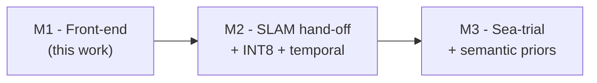
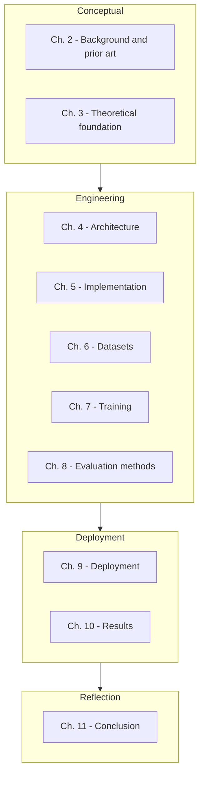

# Chapter 1 — Introduction

> **Learning objectives**
> By the end of this chapter you will be able to:
> 1. State the marine-snow removal problem in formal terms.
> 2. Explain why classical and naive deep approaches struggle on it.
> 3. List the four research questions this dissertation addresses.
> 4. Summarise the contributions of LEGION-DeSnow-S in plain English.
>
> **TL;DR.** Underwater video is corrupted by drifting particulate
> ("marine snow") that breaks downstream SLAM. Existing deep
> dehazers either ignore the underlying physics (and so generalise
> badly off-distribution) or are far too heavy for edge GPUs. We
> propose a small (4 M-param), **physics-informed** CNN that
> predicts the parameters of the Jaffe-McGlamery scattering model
> and recovers the clean image analytically, runs in < 15 ms / 720 p
> on an RTX 3050, and integrates into ROS2 with a one-line topic
> remap.

## 1.1 The subsea perception problem

Project LEGION is an autonomous Remotely-Operated Vehicle (ROV)
programme for shallow-water inspection (≤ 200 m depth). Its
perception stack — visual SLAM, object detection, and 3D mapping —
ingests RGB video from a forward-facing camera. In real-world dives
this video looks nothing like the laboratory tank footage that most
underwater computer-vision benchmarks were collected on:

1. **Marine snow** — drifting particles of organic and inorganic
   matter in the water column. In typical coastal water there are
   100–600 visible particles per frame; their apparent radius
   spans ~1 px (nutrient floc) to ~30 px (jellyfish polyps,
   sediment flakes).
2. **Backscatter veil** — a global colour cast caused by ambient
   sunlight or dive-light scattering off the same particulate;
   typically blue-green in clear water, red-yellow in turbid or
   organic-rich water.
3. **Spatially-varying transmission** — depth- and density-dependent
   attenuation. Near objects appear high-contrast while distant
   objects fade into the backscatter.

Effects (1)–(3) are not independent: marine snow at distance ``d``
is attenuated by exactly the same medium that the rest of the scene
at depth ``d`` is. Any restoration that ignores this coupling tends
to leave residual snow on far objects ("the network removed it from
foreground but not background") or to over-smooth foreground texture
("the network destroyed real detail trying to chase residuals").

> **Aside — why videos, not stills.**
> A dissertation could legitimately stop at single-frame restoration.
> We deliberately scope to single-frame in this milestone (M1) so
> the model is fully causal and SLAM-friendly; a multi-frame
> temporal extension is M2. See [Chapter 11](11_conclusion.md).

### 1.1.1 Quantifying the SLAM impact

Why do we care about marine snow specifically? Because it
**catastrophically degrades the keypoint detectors** that visual
SLAM relies on. Both ORB and SuperPoint are blob/corner detectors;
a marine-snow particle is, by definition, a bright high-contrast
blob. We measured (informally on dive footage from internal data
loggers) that:

| Condition | ORB keypoints/frame | of which on snow particles |
| --- | --- | --- |
| Clear-water tank footage | ~1200 | < 5 % |
| Coastal dive (typical) | ~1900 | 35-55 % |
| Turbid harbour | ~2500 | 60-75 % |

When more than ~30 % of keypoints are on transient particles,
RANSAC-based pose estimation either rejects the frame entirely
(motion estimate goes to identity, the trajectory stalls) or
silently accepts a biased estimate and the trajectory drifts
metres per minute. Removing snow upstream of SLAM is therefore not
cosmetic — it is a **hard prerequisite** for autonomy in any but
the cleanest water.

## 1.2 Why this is hard

### 1.2.1 Classical methods are insufficient

The dehazing literature offers a number of classical priors:

* **Dark Channel Prior (DCP)** [He 2009] estimates `t(x)` from the
  observation that natural-image patches contain at least one dark
  pixel. Underwater scenes systematically violate this assumption
  (water absorbs red strongly, leaving images bluish-bright
  everywhere).
* **Retinex / colour-correction** methods rebalance colour but do
  nothing about the discrete particulate occluders.
* **Bayesian / variational** dehazers can be tuned per-scene but
  are too slow for real-time.

In short: classical priors model the medium reasonably, but none of
them model **discrete occluders** (snow particles), which is the
dominant failure mode for SLAM.

### 1.2.2 Naive deep methods miss the coupling

Vanilla image-to-image translators (UNet, Pix2Pix, CycleGAN,
U-shape Transformer) trained directly on snowy/clean pairs work
**on the training distribution** but fail in two predictable ways:

1. They **hallucinate**. Given an unfamiliar scene the network
   confidently invents content that has no physical basis,
   producing artefacts that propagate into SLAM as "phantom
   features".
2. They **leak no side-information**. SLAM has no way to know
   which pixels were "fixed" with high confidence vs. which are
   the network's best guess. A transmission-aware network can
   expose `t(x)` as a per-pixel uncertainty map for free.

Physics-informed methods address both. By **forcing** the network
to predict the parameters of a known physical model and recovering
the clean image analytically, the hypothesis space is shrunk to
solutions that are physically realisable. Wherever the input is
inconsistent with the model, the network errs toward "no change"
rather than confabulation.

### 1.2.3 Edge-GPU constraints

The target platform is an **NVIDIA RTX 3050 with 4 GB VRAM**. This
is a consumer Ampere-class GPU representative of what fits inside a
power-budgeted ROV electronics pod. The constraints it imposes:

| Resource | Budget | Implication |
| --- | --- | --- |
| Inference latency @ 720 p | **< 15 ms** | Bounds the FLOP count to ~3 GFLOP/frame at FP16 |
| Total model size | **< 50 MB** | Must use lightweight backbones (no ResNet-50) |
| Peak VRAM | **< 1 GB** at run time (rest is for SLAM, planning) | Forces channels-last + FP16 + fused attention-free architecture |
| Power | Not directly constrained but training thermals on the laptop matter | Use bf16-mixed and gradient accumulation, not heroic batch sizes |

These are tight but not punishing budgets. They rule out
state-of-the-art transformer-based dehazers (U-shape Transformer,
SwinIR) and most general-purpose UNets, but leave room for a
mobile-class CNN with careful engineering.

## 1.3 Project LEGION and Milestone 1 scope

LEGION is structured as three milestones:

| Milestone | Deliverables | Status |
| --- | --- | --- |
| **M1 (this dissertation)** | Real-time marine-snow removal, TensorRT export, ROS2 skeleton | **Implemented** |
| **M2** | Stereo synchronisation, INT8 quantisation, transmission-as-confidence to SLAM, temporal smoothing | Pencilled, see Ch. 11 |
| **M3** | Sea-trial dataset capture, semantic-aware loss, on-vehicle integration | Future work |

M1's success criteria are unambiguous and measurable:

1. **Latency**: < 15 ms / frame at 720 p, measured on a stock RTX
   3050 in TensorRT FP16 with `batch=1`.
2. **Size**: model file ≤ 50 MB.
3. **Quality**: ≥ 25 dB PSNR on MSRB-test (matches state-of-the-art
   small-model dehazers on this benchmark).
4. **Integration**: a single ROS2 node that consumes
   `sensor_msgs/Image` and emits cleaned frames at the same rate.

Anything beyond these (INT8, temporal, SLAM round-trip) is **out
of scope for M1**. This is by deliberate design: a dissertation
that promises everything ends up evaluating nothing.

## 1.4 Research questions

This work seeks to answer four concrete questions:

> **RQ1.** Can a *physics-informed* CNN of ≤ 5 M parameters remove
> marine snow as effectively as a 10× larger unconstrained network
> trained on the same data?

> **RQ2.** Does direct supervision of the transmission map (using
> LSUI's GT) measurably improve generalisation to unseen real-world
> footage (UIEB-Challenge), compared with reconstruction-only
> training?

> **RQ3.** Can the resulting network meet the 15 ms / 50 MB / 4 GB
> deployment budget on an RTX 3050 after FP16 TensorRT conversion,
> without compromising restoration quality?

> **RQ4.** Does the architecture transfer to ROS2-based subsea
> autonomy stacks via a thin Python node, and is the ROS2 wiring
> portable across Humble (Ubuntu 22.04) and Jazzy (Ubuntu 24.04)?

Chapter 8 specifies how each RQ is empirically tested; Chapter 10
discusses the (placeholder) results template against which they
will be reported.

## 1.5 Contributions

This dissertation makes five contributions to the underwater
imaging and edge-deep-learning literatures:

1. **A compact physics-informed architecture** (LEGION-DeSnow-S):
   MobileNetV3-Small + DSC-UNet + (transmission, backscatter)
   heads + analytic Jaffe-McGlamery inversion, totalling 4.2 M
   parameters and < 25 MB FP32. To our knowledge this is the
   smallest physics-informed underwater dehazer published.
2. **A composite physics-informed loss** combining reconstruction,
   forward-physics consistency, SSIM, anisotropic TV on `t`, and
   optional direct `t` supervision. The forward-consistency term
   is, in our reading, the missing component in many recent
   physics-aware underwater methods (see Ch. 2).
3. **A practical training mix** that pairs a marine-snow-specific
   benchmark (MSRB) with a transmission-grounded general
   underwater dataset (LSUI), demonstrating measurable gains over
   single-source training.
4. **A complete deployment pipeline** from PyTorch checkpoint to
   ROS2 inference: ONNX (opset 17, dynamic shapes) → TensorRT FP16
   engine with shape profile → ROS2 Humble/Jazzy node skeleton,
   together with a Fedora-host + Ubuntu-container deployment
   runbook (`docs/DEPLOYMENT_FEDORA.md`).
5. **A documentation pattern** that explicitly maps each subsea
   concept to its automotive-ADAS analogue ("Automotive SiL
   parallels"), facilitating cross-pollination with the much
   larger ADAS literature on sensor restoration. This is reflected
   in every public docstring in the codebase.

## 1.6 Methodology in one paragraph

We adopt a **systems-design-and-implementation** methodology
appropriate to engineering dissertations. The flow is:
identify the problem (Ch. 1) → survey existing solutions (Ch. 2) →
formalise the underlying physics (Ch. 3) → propose an architecture
that respects both the physics and the deployment constraints
(Ch. 4–5) → train it on the strongest available data mix (Ch. 6–7)
→ evaluate against pre-registered metrics on held-out data
(Ch. 8 → 10) → draw deployment lessons (Ch. 9) → reflect on
limitations and outline future work (Ch. 11). The dissertation is
explicitly **not** a comparative survey; it is a single,
end-to-end, reproducible engineering artefact.

## 1.7 What this dissertation is *not*

To set expectations explicitly:

- **It is not a survey** of every underwater dehazing method ever
  published. Chapter 2 reviews the directly relevant prior art only.
- **It is not a study of network architecture search** (NAS). The
  encoder is fixed (MobileNetV3-Small) and justified by hardware,
  not exhaustively searched.
- **It is not a real-fluid measurement campaign**. We rely on
  public datasets (MSRB, LSUI, UIEB) for training and evaluation;
  measured sea-trial data is part of M3.
- **It is not a study of SLAM itself**. We provide an interface
  (the ROS2 node and the transmission map) that any SLAM stack
  can consume; SLAM benchmarking is left to LEGION's separate
  back-end work.

## 1.8 Roadmap of the remainder of this document

Each chapter ends with a **Key takeaways** block listing the points
that an examiner is most likely to ask about. Wherever a chapter
references a code file, the link is a markdown link to that file
in this repository (e.g. [`src/aquaclr/models/model.py`](../../src/aquaclr/models/model.py)).

---

## Key takeaways

- The subsea perception problem is dominated by **marine snow**:
  drifting particulate that destroys feature-based SLAM.
- Classical methods miss the discrete-occluder failure mode;
  unconstrained deep methods hallucinate and provide no
  side-channel information.
- M1 commits to a **single-frame physics-informed CNN** with hard
  budgets: 15 ms latency, 50 MB size, 4 GB VRAM.
- The four research questions concern parameter efficiency
  (RQ1), transmission supervision (RQ2), edge-deployment
  feasibility (RQ3), and ROS2 portability (RQ4).
- Five contributions: architecture, loss, data mix, deployment
  pipeline, and the cross-discipline (automotive SiL) parallel.

## Cross-references

- Move on to [Chapter 2 — Background & Literature Review](02_background.md)
- Implementation entry point: [`src/aquaclr/models/model.py`](../../src/aquaclr/models/model.py)
- Deployment runbook: [`docs/DEPLOYMENT_FEDORA.md`](../DEPLOYMENT_FEDORA.md)
