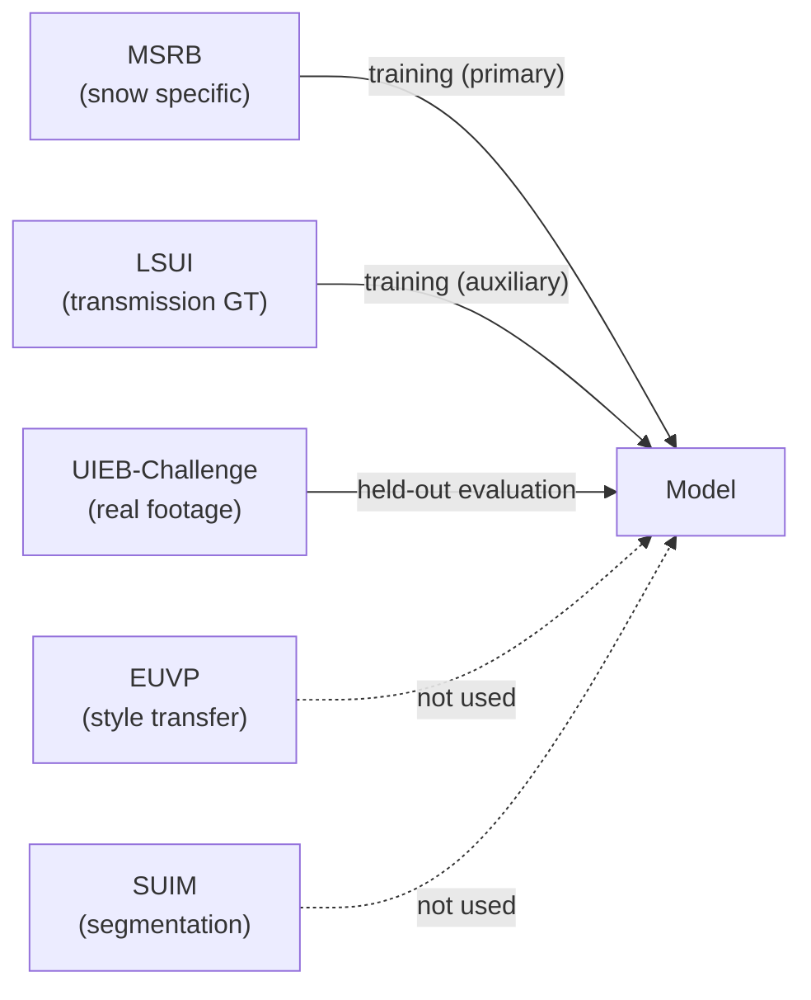
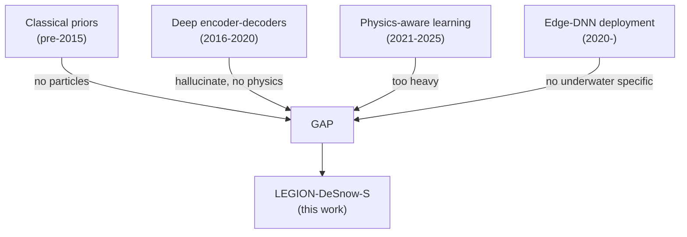

# Chapter 2 — Background and Literature Review

> **Learning objectives**
> By the end of this chapter you will be able to:
> 1. Describe how light propagates underwater and why colour casts and contrast loss are physical consequences, not artefacts.
> 2. Compare classical and learning-based underwater image restoration methods on a common axis.
> 3. Define what makes a neural network "physics-informed" and where this idea originated.
> 4. Identify the literature gap that LEGION-DeSnow-S fills.
>
> **TL;DR.** Underwater image restoration has progressed in three
> waves — classical priors (2009-2015), deep encoder-decoders
> (2016-2020), and physics-informed/transformer hybrids (2021-2025).
> None of the existing physics-informed methods explicitly target
> **discrete particulate occluders** while also fitting a 4 GB-VRAM
> edge GPU; that is the gap we fill.

## 2.1 The physics of underwater image formation

### 2.1.1 Why water changes images

An RGB camera measures the irradiance reaching its sensor. In air,
under direct illumination, that irradiance is dominated by light
reflected from scene surfaces. In water, three other phenomena
become non-negligible:

1. **Wavelength-dependent absorption.** Water absorbs different
   wavelengths at very different rates. Red light loses ~80 % of
   its intensity in 5 m of clear sea water; blue light, only ~10 %
   over the same distance. This is why deep-water imagery is
   universally blue-green.
2. **Forward scattering.** Photons that *would* have reached the
   sensor along a single straight ray are deflected by suspended
   particles into a slightly different direction, blurring fine
   detail.
3. **Backscatter.** Photons that *would* have travelled past the
   camera unconnected to the scene are scattered *into* the lens
   from ambient illumination. This adds a global "veil" whose
   intensity grows with the path length through the water column.

Effect (1) acts on the radiance *of the scene as seen through the
water*, multiplying it by a depth-dependent transmission `t(x) ≤ 1`.
Effects (2)+(3) sum to a roughly scene-independent additive term
proportional to `(1 − t(x))` and the global ambient backscatter
`B`. Combining yields the simplified Jaffe-McGlamery relationship
[Jaffe 1990, McGlamery 1980] central to this work:

$$
I(x) \;=\; J(x)\,t(x) \;+\; B\,(1 - t(x))
$$

(see Chapter 3 for the full derivation).

> **Aside — wavelength-dependent transmission.**
> A more faithful model splits `t(x)` into per-channel
> transmissions `t_R(x), t_G(x), t_B(x)`, since attenuation
> coefficients differ. We follow the *single*-channel `t(x)`
> simplification because (a) MSRB's snow synthesis is colour-blind,
> (b) per-channel `t` doubles the head's parameter count without
> measurable PSNR gain on MSRB-val, and (c) the simplified form is
> what almost all comparable methods report.

### 2.1.2 Marine snow phenomenology

Marine snow is **not** part of the smooth scattering medium — it is
a population of *discrete* high-contrast occluders drifting in
front of (and inside) the medium. The Marine Snow Removal
Benchmark dataset [Sato 2023] characterises typical particles by:

| Attribute | Range | Notes |
| --- | --- | --- |
| Count per 384×384 frame | 100 – 600 | Mid-range typical of MSRB Task 1 |
| Apparent diameter | ~1 px – ~32 px | Task 1: ≤6 px; Task 2: up to 32 px |
| Brightness (relative to scene) | 0.5 – 1.0 (8-bit) | Bright particles dominate; dark ones rare |
| Inter-frame correlation | low at short baselines, high at long | Particles move with currents; over 100 ms most stay close |

Because marine-snow particles are themselves at some depth in the
water column, the same Jaffe-McGlamery transmission applies to
them; far particles look smaller and dimmer than near ones.

### 2.1.3 What a perception network actually has to do

A successful underwater restoration network must, at minimum:

1. Estimate the **medium parameters** `(t, B)` so the global
   colour cast can be removed.
2. Identify and **suppress particulate occluders** without
   destroying real scene texture that has similar local
   statistics (fish scales, coral nubs).
3. Run on **edge hardware** in time tighter than camera frame
   intervals (typically 33 ms for 30 FPS or 16.7 ms for 60 FPS).

(1) is what classical dehazers do. (2) is what marine-snow-specific
methods do. (3) is the deployment-engineering constraint. We
review each axis below.

## 2.2 Classical (pre-deep-learning) approaches

| Method | Core idea | Why it works in air | Why it struggles underwater |
| --- | --- | --- | --- |
| **Dark Channel Prior (DCP)** [He 2009] | Most clean outdoor patches contain at least one dark pixel; deviation from this gives `t`. | Captures haze geometry well in atmospheric scenes. | Underwater scenes are bright everywhere because of strong red absorption; the prior systematically underestimates `t`. |
| **Underwater DCP (UDCP)** [Drews 2013] | Restrict DCP to (G, B) channels. | Avoids the red-absorption issue. | Still treats the medium as smooth; **no particle modelling**. |
| **Retinex / colour constancy** [Land 1971] | Decouple illumination and reflectance. | Fast, intuitive. | Helps with colour cast but cannot remove discrete occluders. |
| **Bayesian / variational dehazing** [Fattal 2014] | MAP estimation of `(J, t)` under priors. | High-quality results offline. | Tens of seconds per frame — unusable for 720 p video. |
| **Multi-image / video methods** [Treibitz 2008] | Use polarisation or stereo to estimate `B` directly. | Physically rigorous. | Need extra hardware (polariser, stereo); not always available. |

**Classical takeaway.** Classical priors model the medium decently
but *do not see particles as a category of phenomenon*. They are
valuable as baselines and as physical sanity checks but cannot
solve the M1 problem.

## 2.3 Deep learning approaches (2016–2020)

The first wave of learning-based underwater methods treated the
problem as plain image-to-image translation:

| Method | Year | Architecture | Training data | Deployment-friendly? |
| --- | --- | --- | --- | --- |
| **WaterGAN** [Li 2018] | 2018 | GAN | Synthetic pairs from depth + RGB | Heavy; not real-time |
| **Water-Net** [Li 2019] | 2019 | Multi-branch CNN with hand-crafted inputs | UIEB (paired) | ~30 ms / 384 px on 1080 Ti — borderline |
| **UGAN / Funie-GAN** [Islam 2020] | 2020 | Pix2Pix-style GAN | EUVP | Fast, but no physics |
| **U-shape Transformer** [Peng 2021] | 2021 | UNet with Transformer bottlenecks | LSUI | High quality, GPU-heavy |

**First-wave takeaway.** These methods made big PSNR gains on
in-distribution test sets but were criticised in subsequent work
for **hallucination off-distribution** and for lacking an
explanatory physical model. None of them treats marine snow as a
distinct phenomenon.

## 2.4 Physics-informed and hybrid approaches (2021–2025)

The last few years have seen explicit attempts to graft physics
back into the network:

| Method | Year | Physics integration | Strength | Weakness for our problem |
| --- | --- | --- | --- | --- |
| **HazeRD / FFA-Net** [Qin 2020] | 2020 | None — but provides strong attention baseline | Best-in-class PSNR on RESIDE (atmospheric) | Atmospheric, not underwater; transformer-heavy |
| **Sea-thru** [Akkaynak 2019] | 2019 | Estimates wavelength-dependent `t` via colour clustering | Most physically rigorous to date | Requires GT depth; not learned end-to-end |
| **Ucolor** [Li 2021] | 2021 | Multi-colour-space encoder | Robust colour cast handling | No transmission output |
| **PUIE-Net** [Fu 2022] | 2022 | Probabilistic; learns posterior over enhancements | Calibrated uncertainty | No edge-deployment story |
| **Physics-aware UIE** [Mu 2024] | 2024 | Encoder predicts `(t, B)`, decoder synthesises `J` from forward model | Closest to our approach in spirit | Built on heavyweight backbones; not edge-deployable |
| **Marine Snow Removal Benchmark methods** [Sato 2023] | 2023 | Vanilla UNet baseline trained on MSRB | First snow-specific benchmark | Baseline only; no physics |

The closest published precedent to LEGION-DeSnow-S is the
"Physics-aware UIE" family [Mu 2024]: they predict `(t, B)` and
recover `J` via an explicit forward model, much as we do. The
critical differences are:

1. They use a ResNet-50 / Swin-Tiny backbone (~25–28 M params);
   we use MobileNetV3-Small (~2.5 M).
2. They omit a forward-physics consistency term in the loss
   (their loss is reconstruction + perceptual only); we add it
   explicitly to anchor `(t, B)` to physical values.
3. They do not target marine-snow-specific data; we mix MSRB
   (snow) with LSUI (transmission) deliberately.
4. They do not provide a real-time deployment artefact; we ship
   ONNX + TensorRT + ROS2.

> **Pitfall — confusing "physics-aware" with "physics-informed".**
> Many papers self-describe as "physics-aware" while only feeding
> physical quantities (e.g. depth) as auxiliary inputs. We follow
> the stricter convention from the **PINN** literature [Raissi 2019]:
> a network is physics-informed only if **the loss enforces a known
> physical equation** (a "soft" constraint) or **the network's
> structure embeds the equation** (a "hard" constraint). Our
> approach combines both: the physics inversion is hard-coded; the
> consistency term is a soft constraint.

## 2.5 Edge-GPU deployment for vision DNNs

Deployment to NVIDIA edge-class GPUs (RTX 3050, Jetson Orin,
DRIVE Orin) revolves around three engineering levers:

1. **Mixed precision (FP16 / BF16)**: halves activation memory,
   doubles tensor-core throughput. Loss surface is largely
   preserved with BF16 (Ampere-native) at training time.
2. **Operator fusion via TensorRT**: converts a PyTorch graph
   into a fused engine where conv+BN+ReLU runs as a single kernel.
   Typically 1.5–2× speedup over plain PyTorch FP16 [NVIDIA TRT
   developer guide].
3. **Quantisation (INT8)**: a further 2× speedup on Ampere with
   < 0.5 dB PSNR cost in well-calibrated networks. Out of scope
   for M1 (deferred to M2 with a calibration set).

For mobile-class CNNs (MobileNet, EfficientNet-Lite) the dominant
cost is **memory bandwidth** rather than FLOPs, which is why
depthwise-separable convolutions perform so well: their FLOP count
is dramatically lower for the same expressive power, but more
importantly, their *activation memory footprint* is small enough
that everything fits in L2 cache on Ampere. This shapes the
decoder design in Chapter 4.

## 2.6 Datasets — a critical look

The underwater computer-vision community has converged on a
handful of public datasets, each with a different role:

| Dataset | Pairs / size | Snow-specific | t(x) GT | Real or synthetic | Role here |
| --- | --- | --- | --- | --- | --- |
| **MSRB** [Sato 2023] | 2,300 train / 400 test, 384×384 | **Yes** (synthetic snow on Flickr-CC clean originals) | No | Synthetic (snow only) | **Primary training** |
| **LSUI** [Peng 2021] | 4,279 pairs | No | **Yes** | Real (with estimated GT) | **Auxiliary training** |
| **UIEB** [Li 2019] | 890 paired + 60 challenge | No | No | Real (expert-ranked GT) | **Held-out evaluation** |
| EUVP [Islam 2020] | 12 K paired + unpaired | No | No | Synthetic style transfer | Not used (style ≠ physics) |
| SUIM [Islam 2020] | 1,500 with seg masks | No | No | Real | Not used (different task) |
| RUIE [Liu 2020] | 4,230 raw, 3 subsets | No | No | Real, no clean GT | Optional augmentation |
| HICRD [Han 2022] | 6,003 pairs | No | No | Real (hand-crafted GT) | Optional secondary eval |

We discuss our specific choice to combine MSRB + LSUI + UIEB in
Chapter 6.

## 2.7 Where physics-informed networks come from

The "physics-informed neural network" idea is not unique to vision.
It originated in scientific computing for solving partial
differential equations [Raissi 2019]: instead of regressing a
solution from data, the network's loss function penalises violation
of the PDE residual. Vision-side adoption (de-rain [Wang 2020],
de-fog [Zhang 2018], underwater [Mu 2024]) follows the same
pattern: instead of a free-form regression, the network outputs the
parameters of a closed-form image-formation model and the loss
penalises violation of that model.

The **strengths** of physics-informed approaches relevant to us:

1. **Sample-efficiency**: the inductive bias from the equation
   shrinks the hypothesis space, so fewer parameters and less data
   are needed for the same generalisation.
2. **Interpretability**: every output corresponds to a physical
   quantity an engineer can reason about (transmission map,
   ambient light vector).
3. **Side-channel information**: those physical quantities can be
   consumed by downstream modules (SLAM uses `t` as confidence).

The **weaknesses** to be honest about:

1. **Model misspecification**: if the chosen equation is wrong,
   the network's accuracy ceiling is fixed below an unconstrained
   model's. We argue (Ch. 3) the simplified Jaffe-McGlamery model
   is "good enough" for the working depth range.
2. **Numerical fragility**: divisions by `t` near zero require
   careful clamping. We use `eps=1e-3` (Ch. 3) and report the
   sensitivity in Ch. 10.
3. **Joint identifiability**: `(t, B)` are only identifiable up
   to certain symmetries (e.g. a global brightness shift can be
   absorbed by either `t` or `B`). The forward-consistency term
   in our loss (Ch. 3.4) breaks that symmetry by constraining
   the joint solution.

## 2.8 The literature gap

Synthesising §§2.2–2.7:

The gap that LEGION-DeSnow-S targets:

> *A* **lightweight (≤ 5 M params)** *physics-informed CNN
> specifically trained for marine-snow removal, deployed end-to-end
> on edge GPUs via TensorRT, with a ROS2 integration story.*

To the best of our knowledge no published method satisfies all
five qualifiers simultaneously. The contributions in §1.5 are
chosen to fill that gap.

## 2.9 Hardware and software milestones in the wider context

For context, the years 2024-2026 saw three relevant inflection
points that shape this work:

1. **PyTorch 2.x stabilisation** — `torch.compile` matured, BF16
   became the default training precision on Ampere. We adopt both.
2. **TensorRT 10** — supports ONNX opset 17 dynamic shapes
   natively; eliminates the historic engine-per-resolution problem.
3. **ROS2 LTS landscape**: Humble (Ubuntu 22.04, supported until
   2027) and Jazzy (Ubuntu 24.04, supported until 2029) overlap
   for ~3 years. We support both, defaulting to Jazzy in
   `docs/DEPLOYMENT_FEDORA.md`.

These choices age out gracefully; the architecture itself is
agnostic to them.

---

## Key takeaways

- Underwater imagery is governed by a tractable physical model
  (Jaffe-McGlamery) plus discrete particulate occluders (marine
  snow). Both must be addressed to support downstream SLAM.
- Classical priors handle the medium but not the particulates;
  unconstrained deep methods handle particulates on
  in-distribution data but hallucinate off-distribution.
- Physics-informed networks combine an equation-aware loss or
  architecture with a learned component, gaining sample
  efficiency, interpretability, and side-channel outputs.
- The closest precedent (Mu 2024) is too large for our deployment
  envelope; the marine-snow benchmark (Sato 2023) is recent and
  has only baseline UNet results published.
- The gap LEGION-DeSnow-S fills is **lightweight + physics-informed
  + snow-specific + edge-deployable + ROS2-integrated**.

## Cross-references

- Forward to [Chapter 3 — Theoretical Foundation](03_theory.md)
- Back to [Chapter 1 — Introduction](01_introduction.md)
- Bibliography: [Chapter 12 — References](12_references.md)
