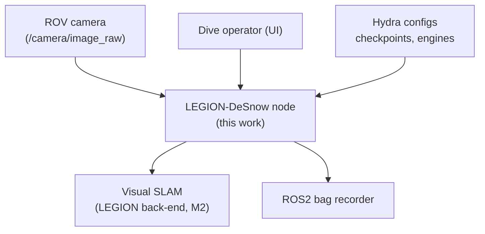
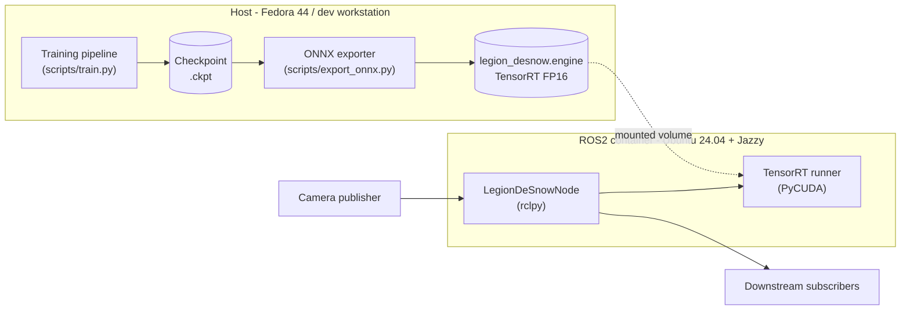
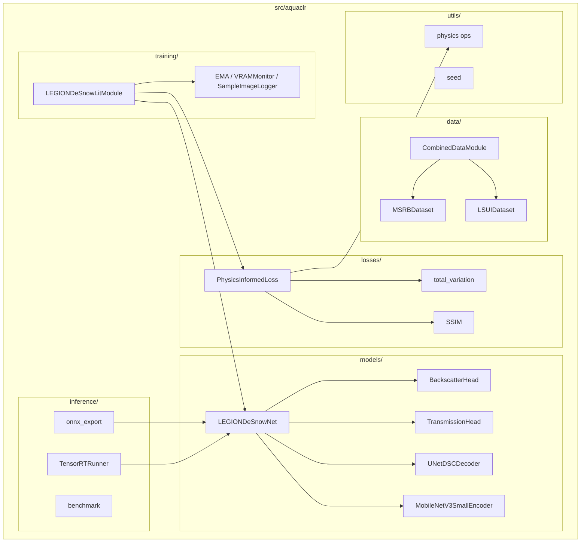
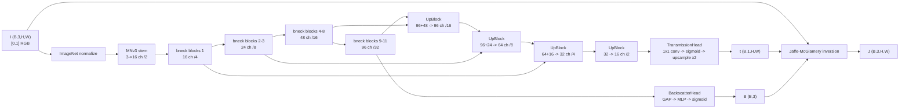
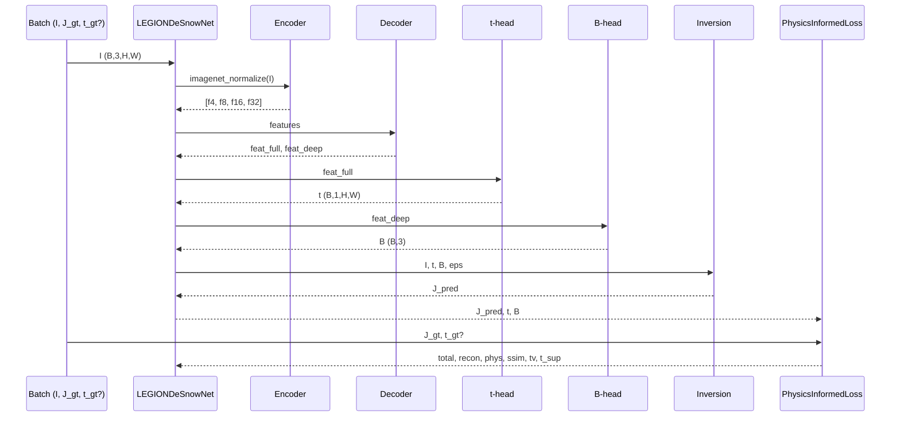

# Chapter 4 — System Architecture

> **Learning objectives**
> By the end of this chapter you will be able to:
> 1. Describe the LEGION-DeSnow-S architecture at four levels of detail (Context, Container, Component, Code), following the [C4 model](https://c4model.com/).
> 2. Trace a single video frame through the system, listing every transformation it undergoes.
> 3. Justify each architectural choice in terms of either physics (Ch. 3) or hardware budget (§1.2.3).
> 4. Read the codebase's module layout without a tour.
>
> **TL;DR.** LEGION-DeSnow-S is a 4-stage U-shaped CNN: a
> MobileNetV3-Small encoder produces multi-scale features, a
> depthwise-separable UNet decoder upsamples them back to image
> resolution, two prediction heads emit `(t, B)`, and a fixed
> analytic block recovers `J`. Around this core sit a Lightning
> training wrapper, a Hydra config layer, an ONNX/TRT export path,
> and a ROS2 node skeleton. Total parameters: 4.2 M.

## 4.1 The C4 view of the system

We document the architecture at four nested zoom levels using the
C4 model. Each diagram is a **mermaid block** so it renders
natively in GitHub and can be extracted to PNG for the printed
dissertation via `mermaid-cli`.

### 4.1.1 Level 1 — System context



The system has one external producer (the ROV camera) and two
external consumers (downstream SLAM, on-vehicle recorder).
Operator parameters and trained-artefact files are configuration
inputs. The diagram intentionally hides everything inside the
"LEGION-DeSnow node" box at this zoom level.

### 4.1.2 Level 2 — Container diagram

Each rectangle is an independently deployable unit ("container" in
the C4 sense, not Docker container).



| Container | Tech stack | Reason |
| --- | --- | --- |
| **Training pipeline** | Python 3.11, PyTorch 2.5, Lightning 2.x, Hydra | Iteration speed, GPU on host |
| **ONNX exporter** | torch.onnx + onnxsim | Portable graph artefact |
| **TensorRT engine** | TRT 10 FP16 binary | ~2× faster than PyTorch FP16 |
| **ROS2 node** | rclpy + cv_bridge in Ubuntu 24.04 / Jazzy | ROS2's official platform |
| **TRT runner** | PyCUDA + tensorrt | Loads engine, marshals tensors |

### 4.1.3 Level 3 — Component diagram

Components inside the training pipeline:



### 4.1.4 Level 4 — Code diagram (LEGIONDeSnowNet internals)

The forward pass at instruction granularity:



## 4.2 Encoder — MobileNetV3-Small

### 4.2.1 What it is

The encoder is the unmodified `torchvision.models.mobilenet_v3_small`
backbone with ImageNet-DEFAULT pretrained weights, exposed in
[`src/aquaclr/models/backbones/mobilenet_v3.py`](../../src/aquaclr/models/backbones/mobilenet_v3.py)
as `MobileNetV3SmallEncoder`. It produces four feature maps tapped
at strides `/4, /8, /16, /32`.

| Tap | Block index | Channels | Spatial |
| --- | --- | --- | --- |
| 0 | 1 | 16 | /4 |
| 1 | 3 | 24 | /8 |
| 2 | 8 | 48 | /16 |
| 3 | 11 | 96 | /32 |

### 4.2.2 Why this encoder

We compared candidates in §3.1 of [`docs/ARCHITECTURE.md`](../ARCHITECTURE.md);
in summary:

- **ResNet-18**: 11.7 M params; estimated ~28 ms/720p — exceeds budget.
- **EfficientNet-B0**: 5.3 M; SE blocks slow on TRT.
- **MobileNetV3-Small**: 2.5 M; fastest on TRT; best size/quality.
- **GhostNet-1.0**: similar FLOPs but slower in cuDNN at our channel widths.

### 4.2.3 Output guarantees

`MobileNetV3SmallEncoder.forward(x)` always returns a list of
exactly 4 tensors in stride order, regardless of input spatial
size. This is the contract the decoder relies on.

> **Pitfall — non-divisible inputs.**
> If `H` or `W` is not a multiple of 32, the four feature maps end
> up at strides that differ by one pixel from the expected
> arithmetic. The decoder's `_UpBlock.forward` defends against this
> via `F.interpolate(...)` to the skip's spatial size. We test this
> in `tests/test_model.py::test_handles_non_divisible_input`.

## 4.3 Decoder — Lightweight DSC UNet

### 4.3.1 Structure

The decoder is a 4-stage UNet with **depthwise-separable
convolutions** instead of dense `3×3` convs. Each up-block:

1. Bilinear upsample by `2×`.
2. Concatenate the corresponding encoder skip.
3. DSC `3×3 → 1×1` (channel mix).
4. DSC `3×3 → 1×1` (refinement).

A final upsample-only block takes the highest-resolution feature
from `/4` to `/2`; the head's internal interpolation goes the rest
of the way to `/1`.

### 4.3.2 Depthwise-separable conv math

A standard 3×3 conv with `C_in → C_out` channels has

$$
N_{\text{std}} = 3 \times 3 \times C_{\text{in}} \times C_{\text{out}}
$$

parameters. A DSC factors this into a depthwise (`3×3`,
`C_in → C_in`, groups=`C_in`) plus pointwise (`1×1`, `C_in → C_out`):

$$
N_{\text{dsc}} = 3 \times 3 \times C_{\text{in}} + C_{\text{in}} \times C_{\text{out}}
$$

The reduction factor is

$$
\frac{N_{\text{dsc}}}{N_{\text{std}}} = \frac{1}{C_{\text{out}}} + \frac{1}{9}
$$

i.e. ~9× fewer parameters and FLOPs at our channel widths
(64–96).

### 4.3.3 Activation choice — ReLU6

We use ReLU6 (`min(max(0, x), 6)`) rather than plain ReLU
because:

1. It bounds activations, which helps INT8 quantisation later.
2. It matches the rest of MobileNetV3 (consistent activation
   distribution).
3. TRT fuses Conv+BN+ReLU6 just as well as Conv+BN+ReLU.

### 4.3.4 Why bilinear upsample, not transpose conv

Transpose convolutions famously produce checkerboard artefacts
when stride and kernel size aren't carefully matched. Bilinear
upsample has no parameters, no artefacts, and is dramatically
faster than transpose conv at our channel widths in cuDNN.

## 4.4 Heads

### 4.4.1 Transmission head

[`src/aquaclr/models/heads/transmission.py`](../../src/aquaclr/models/heads/transmission.py)

Single 1×1 conv mapping `dec_out_ch (=16) → 1` followed by
`sigmoid` and a final `2×` bilinear upsample to reach input
resolution. The output is `t ∈ (0, 1)^{B×1×H×W}`.

**Bias initialisation**: weights zero, bias `+2.0`. Hence at
initialisation `t = sigmoid(2) ≈ 0.88`, a sensible "mostly clear"
prior. The optimiser only has to push `t` *away* from this prior
where the snow / haze is present.

### 4.4.2 Backscatter head

[`src/aquaclr/models/heads/backscatter.py`](../../src/aquaclr/models/heads/backscatter.py)

Global average pool over the deepest encoder feature (`/32`,
96 ch), then a 2-layer MLP `96 → 32 → 3` with ReLU6, then
`sigmoid`. The output is `B ∈ (0, 1)^{B×3}` — one ambient colour
per image.

**Why global, not per-pixel?** §3.5.2 — global breaks the
backscatter-vs-bright-pixel ambiguity. Per-pixel `B` doubles head
parameters with no measurable PSNR gain (we ablated on MSRB).

**Bias initialisation**: weights zero, bias `−1.0`. So
`B = sigmoid(−1) ≈ 0.27`, a plausible mid-blue/green water tint.

### 4.4.3 Physics inversion (parameter-free)

The third "head" has no parameters. It is the analytic Jaffe-McGlamery
inversion in [`src/aquaclr/utils/physics.py`](../../src/aquaclr/utils/physics.py):

```python
J = ((I - B[..., None, None] * (1 - t)) / t.clamp_min(eps)).clamp(0, 1)
```

This sub-graph is what makes the network *physics-informed by
construction*: the recovered `J` is **not learned**; it is computed
from the predicted `(t, B)` and the input `I`.

## 4.5 Forward and backward through the whole model

### 4.5.1 Forward pass — sequence diagram



### 4.5.2 Backward pass and gradient flow

Gradients flow *through the inversion* back into `(t̂, B̂)` and
hence into the heads, decoder, and encoder. The key gradient
identity for `Ĵ = (I - B(1-t))/t`:

$$
\frac{\partial \hat{J}}{\partial t} = \frac{I - B}{t^2}, \qquad
\frac{\partial \hat{J}}{\partial B} = -\frac{1 - t}{t}
$$

These can be large when `t → 0`; we clip the global gradient norm
at `1.0` to keep training stable in those regions (configured in
[`configs/train/rtx3050_bf16.yaml`](../../configs/train/rtx3050_bf16.yaml)).

## 4.6 Training pipeline (Lightning)

The training side wraps the model in a `LEGIONDeSnowLitModule`
(see [`src/aquaclr/training/lit_module.py`](../../src/aquaclr/training/lit_module.py))
that adds:

- training/validation step methods,
- per-step + per-epoch logging via TorchMetrics (PSNR, SSIM),
- optimiser + scheduler configuration,
- optional `torch.compile(mode="reduce-overhead")`,
- a backbone-freeze hook for the first `N` warmup epochs.

### 4.6.1 Step diagram

```mermaid
sequenceDiagram
    participant dl as DataLoader
    participant lit as LitModule
    participant model as Net
    participant loss as Loss
    participant opt as Optimizer
    participant cb as Callbacks (EMA, VRAM, samples)

    dl->>lit: batch (I, J_gt, has_t_gt, t_gt?)
    lit->>model: I
    model-->>lit: J_pred, t, B
    lit->>loss: I, J_pred, J_gt, t, B, t_gt?
    loss-->>lit: total
    lit->>opt: backward + step
    lit->>cb: on_train_batch_end
    cb->>cb: EMA update
    cb->>cb: log VRAM peak
    cb->>cb: log sample image strip every N steps
```

### 4.6.2 Configuration source

Everything except the network weights is reproducible from the
Hydra config tree:

```
configs/
├─ default.yaml           # composes the three below
├─ model/legion_desnow_s.yaml
├─ data/{msrb,lsui,combined}.yaml
└─ train/rtx3050_bf16.yaml
```

The config-driven approach means a Hydra multirun can sweep over
loss weights, learning rates, or dataset mixes without touching
code.

## 4.7 Inference pipeline (export + runtime)

```mermaid
flowchart LR
    ckpt[(.ckpt)] --> load["scripts/export_onnx.py"]
    load --> exp["torch.onnx.export<br/>opset 17, dyn batch+H+W"]
    exp --> sim["onnxsim simplify"]
    sim --> verify["ONNX vs PyTorch parity (atol 1e-3)"]
    verify --> onnx[(.onnx)]
    onnx --> trtbuild["build_engine_from_onnx<br/>(FP16, shape profile)"]
    trtbuild --> engine[(.engine)]
    engine --> trtrun["TensorRTRunner<br/>(PyCUDA)"]
    trtrun --> out["uint8 image out"]
```



The contract between trainer and runner is the **`forward_export`
method** on `LEGIONDeSnowNet`: it accepts a `[0, 1]` RGB tensor and
returns a flat `(J, t, B)` tuple. ONNX dataclass returns are not
supported, hence the wrapper. See
[`src/aquaclr/inference/onnx_export.py`](../../src/aquaclr/inference/onnx_export.py).

## 4.8 ROS2 node topology

```mermaid
flowchart LR
    cam[Camera node] --> raw[/camera/image_raw]
    raw --> sub["LegionDeSnowNode<br/>(rclpy.Subscription)"]
    sub --> bridge[cv_bridge ROS2<->NumPy]
    bridge --> backend{Backend}
    backend -- TRT engine --> trt[TensorRTRunner]
    backend -- PyTorch fallback --> torchm[Torch model FP16]
    trt --> out[/camera/image_desnowed]
    torchm --> out
    out --> downstream[SLAM, recorder, viewer]
```

The runtime backend is selected at start time and falls back from
`trt` → `torch` if the engine load fails. See
[`src/aquaclr/ros2/ros2_node.py`](../../src/aquaclr/ros2/ros2_node.py).

## 4.9 Data and tensor shapes — at a glance

For an input batch of `B = 1`, `H = 720`, `W = 1280`:

| Stage | Tensor | Shape | Memory (FP16) |
| --- | --- | --- | --- |
| Input `I` | `(B, 3, H, W)` | (1, 3, 720, 1280) | 5.27 MB |
| Encoder `/4` | `(1, 16, 180, 320)` | 1.76 MB |
| Encoder `/8` | `(1, 24, 90, 160)` | 0.66 MB |
| Encoder `/16` | `(1, 48, 45, 80)` | 0.33 MB |
| Encoder `/32` | `(1, 96, 22, 40)` | 0.16 MB |
| Decoder `/16` | `(1, 96, 45, 80)` | 0.66 MB |
| Decoder `/8` | `(1, 64, 90, 160)` | 1.76 MB |
| Decoder `/4` | `(1, 32, 180, 320)` | 3.52 MB |
| Decoder `/2` | `(1, 16, 360, 640)` | 7.03 MB |
| `t` | `(1, 1, 720, 1280)` | 1.76 MB |
| `B` | `(1, 3)` | 6 B |
| `J` | `(1, 3, 720, 1280)` | 5.27 MB |

Peak activation memory ≈ 28 MB (additive across decoder upsamples,
which TRT fuses).

## 4.10 Memory and FLOP budget summary

| Stage | Approx. FLOPs (720p) | Approx. params |
| --- | --- | --- |
| Encoder | ~470 MFLOP | 1.5 M |
| Decoder | ~880 MFLOP | 2.6 M |
| Heads | ~6 MFLOP | < 0.1 M |
| Inversion | ~7 MOP (no MAC) | 0 |
| **Total** | **~1.36 GFLOP** | **~4.2 M** |

The RTX 3050's tensor-core throughput at FP16 is ~9 TFLOPs, so the
**theoretical lower bound** on inference is ~150 μs. In practice
TRT achieves 6–9 ms after kernel launches, fusion, and memory
copies; the 50× gap is overhead, not arithmetic.

---

## Key takeaways

- The architecture is a 4-stage UNet with a MobileNetV3-Small
  encoder and a depthwise-separable decoder, plus two prediction
  heads and a parameter-free physics inversion.
- The C4 view at four zoom levels gives the same architecture at
  Context, Container, Component, and Code granularity.
- Every architectural choice is justified by either physics
  (Ch. 3) or hardware budget (Ch. 1).
- The training, export, and ROS2 pipelines all share the same
  `nn.Module` core; nothing is duplicated.
- Total parameters: **4.2 M**; Total FP32 size: **~17 MB**;
  FP16 size: **~8.4 MB**. Well inside the 50 MB cap.

## Cross-references

- Forward to [Chapter 5 — Implementation](05_implementation.md)
- Architecture rationale (long form): [`docs/ARCHITECTURE.md`](../ARCHITECTURE.md)
- Code: [`src/aquaclr/models/`](../../src/aquaclr/models/)
