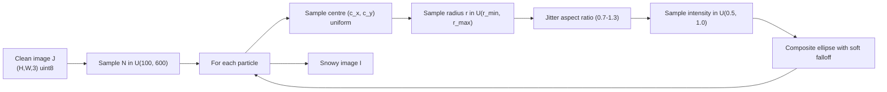
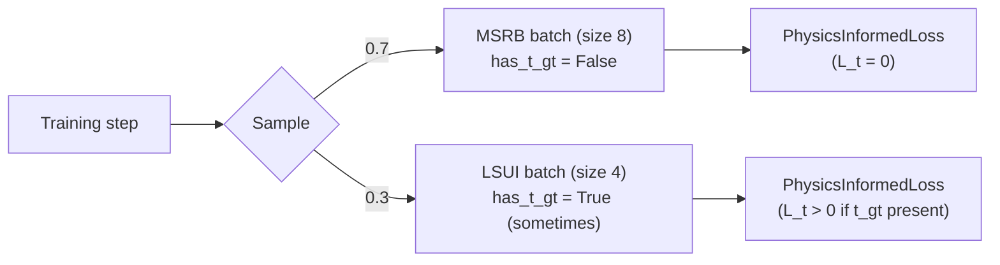

# Chapter 6 — Datasets and Data Methodology

> **Learning objectives**
> By the end of this chapter you will be able to:
> 1. Describe the three datasets used (MSRB, LSUI, UIEB) and what each contributes.
> 2. Explain why we mix MSRB and LSUI for training rather than using either alone.
> 3. Reproduce the augmentation pipeline byte-for-byte.
> 4. Critique the synthetic snow generator and know when its output is trustworthy.
>
> **TL;DR.** We train on **MSRB** (snow-specific, 2,300 / 400
> pairs) mixed 70/30 with **LSUI** (4,279 paired underwater images
> with transmission GT). We evaluate on a held-out subset of MSRB
> for in-distribution metrics and **UIEB-Challenge** for
> out-of-distribution generalisation. Augmentations are atomic
> over `(I, J, t_gt)` triples; photometric jitter is applied to `I`
> only.

## 6.1 Why three datasets, not one?

A single dataset cannot satisfy three different requirements
simultaneously:

| Requirement | Best satisfied by | Why |
| --- | --- | --- |
| (i) The training signal must contain marine-snow particulates | **MSRB** | Purpose-built for this exact problem; controlled particle counts, sizes, intensities |
| (ii) Some training examples must include transmission GT | **LSUI** | One of very few public datasets with `t_gt` |
| (iii) Generalisation must be tested on real-world data the model has never seen | **UIEB-Challenge** | 60 unpaired challenging frames covering multiple water types |

Trying to satisfy (i) with LSUI alone fails: LSUI's "degraded"
inputs lack discrete particulates. Trying (ii) with MSRB fails:
MSRB's clean originals come from Flickr divers and have whatever
scattering Flickr's authors experienced — there's no GT
transmission. Trying (iii) on the held-out test of either training
source fails because the model has implicitly seen the
distribution.

The mix `(MSRB + LSUI training) → UIEB evaluation` is the
canonical recipe in modern underwater image enhancement papers
[Mu 2024, Peng 2021], and we adopt it here.

## 6.2 MSRB — Marine Snow Removal Benchmark

### 6.2.1 Provenance

| Field | Value |
| --- | --- |
| Citation | Sato et al., *Marine Snow Removal Benchmarking Dataset*, APSIPA ASC 2023 [Sato 2023] |
| arXiv | [2103.14249](https://arxiv.org/abs/2103.14249) |
| Repository | [github.com/ychtanaka/marine-snow](https://github.com/ychtanaka/marine-snow) |
| License | Original images CC-BY (Flickr); synthetic snow under research license |
| Size | 2.0 GB (uncompressed) |

### 6.2.2 Composition

- **Train**: 2,300 image pairs at 384×384 px.
- **Test**: 400 image pairs at 384×384 px.
- Each pair = `(noisy snowy I, clean J)` of the same scene.
- Two tasks differ in the snow-particle size distribution:
  - **Task 1**: small particles, max width/height 6 px (~1.6 % of
    image width).
  - **Task 2**: mixed sizes, with 0.7 probability of small (Task 1)
    and 0.3 probability of large (max 32 px, ~8.3 %).

### 6.2.3 Particle synthesis pipeline (per Sato 2023)

For each clean image `J`:

1. Sample `N` ∈ U(100, 600) — number of particles.
2. For each particle:
   1. Sample centre `(c_x, c_y)` uniformly over the image.
   2. Sample radius `r` from the task-specific distribution.
   3. Sample brightness `α ∈ U(0.5, 1.0)`.
   4. Render the elliptical particle with a soft falloff at the
      edge (anti-aliasing).
3. Composite particles onto `J` to produce `I = J + particles`.

### 6.2.4 What we use it for

- **Primary training signal** for marine-snow removal.
- **MSRB-test** is held back from training and used as the
  in-distribution evaluation set in Chapter 8.

### 6.2.5 Layout expected on disk

We follow the canonical upstream layout from the
[`ychtanaka/marine-snow`](https://github.com/ychtanaka/marine-snow)
repository verbatim, so that no archive-side renames are required:

```
data/msrb/
├─ training/
│  ├─ original/    # clean reference J, 384x384 PNGs
│  ├─ MSR_Task1/   # snowy I — small particles (<=6 px)
│  └─ MSR_Task2/   # snowy I — mixed sizes (<=32 px)
└─ test/
   ├─ original/
   ├─ MSR_Task1/
   └─ MSR_Task2/
```

The `MSRBDataset` class
([`src/aquaclr/data/msrb_dataset.py`](../../src/aquaclr/data/msrb_dataset.py))
pairs files by stem and raises a clear error if the layout is wrong.
The `task` argument (1 or 2) selects which snowy variant is paired
against `original/`. For backward compatibility, the loader also
auto-detects the older flattened layout
(`train/{clean,noisy}` and `test/{clean,noisy}`).

### 6.2.6 Synth-fallback for development

If the snowy variant directory (`training/MSR_Task{1,2}/`, or the
legacy `train/noisy/`) is empty but the clean directory is populated,
the loader falls back to **on-the-fly synthesis** via
`aquaclr.data.snow_synthesis.synthesize_marine_snow` (see §6.5).
This lets a developer run the full training loop end-to-end on
even a tiny set of clean images, without having to download MSRB.
Production runs should always use the real MSRB pairs.

### 6.2.7 Critique

| Strength | Weakness |
| --- | --- |
| First public benchmark targeted at marine snow specifically | Snow is **synthesised** — particle statistics may not match real coastal water |
| Two task variants stress-test multiple size regimes | Clean originals are recreational tropical Flickr divers; cold-water bias absent |
| Compact (2 GB) — easy to ship | No transmission ground truth |
| Clear evaluation protocol (PSNR / SSIM on test) | Single-frame only; no temporal correlation |

## 6.3 LSUI — Large-Scale Underwater Image dataset

### 6.3.1 Provenance

| Field | Value |
| --- | --- |
| Citation | Peng et al., *U-shape Transformer for Underwater Image Enhancement*, 2021 [Peng 2021] |
| Project page | [lintaopeng.github.io](https://lintaopeng.github.io/_pages/UIE%20Project%20Page.html) |
| License | Research-only |
| Size | ~3 GB |

### 6.3.2 Composition

- 4,279 paired underwater images (degraded + reference enhanced).
- A subset includes **GT medium transmission maps** generated by
  classical depth-from-haze algorithms.
- Multiple water types, depths, and lighting conditions —
  significantly more diverse than UIEB.

### 6.3.3 What makes the transmission GT special

LSUI is one of the only public underwater datasets that ships GT
`t(x)` maps. We use them as a **soft target** for the transmission
head (`L_t` term, weight 0.5). The maps are themselves estimated
(not measured), which is why we cap the weight rather than treat
them as hard supervision.

### 6.3.4 What we use it for

- Auxiliary training signal — physical grounding of the
  transmission head.
- LSUI-val is **not** our primary evaluation; that role is
  reserved for MSRB-test (in-distribution) and UIEB-Challenge
  (real-world).

### 6.3.5 Layout

```
data/lsui/
├─ input/         # raw underwater I, jpg/png
├─ GT/            # paired enhanced reference J
└─ transmission/  # optional: paired transmission GT t (single-channel PNG)
```

Files are paired by **filename stem**. The
[`LSUIDataset`](../../src/aquaclr/data/lsui_dataset.py) class is
robust to a missing `transmission/` folder — in that case
`load_transmission_gt=False` and the dataset behaves like a plain
`(I, J)` paired dataset.

## 6.4 UIEB — Underwater Image Enhancement Benchmark

### 6.4.1 Provenance

| Field | Value |
| --- | --- |
| Citation | Li et al., *An Underwater Image Enhancement Benchmark Dataset and Beyond*, IEEE TIP 2019 [Li 2019] |
| Project page | [li-chongyi.github.io/proj_benchmark.html](https://li-chongyi.github.io/proj_benchmark.html) |
| arXiv | [1901.05495](https://arxiv.org/abs/1901.05495) |
| License | Research-only |

### 6.4.2 Composition

- **890 paired** images: a real underwater frame + an
  expert-ranked "reference enhanced" version chosen from candidates
  produced by classical methods.
- **60 unpaired challenging** images (UIEB-Challenge): notoriously
  difficult real-world frames covering extreme turbidity, deep
  blue, green-tinted, and harbour scenes.

### 6.4.3 What we use it for

**UIEB-Challenge only**, as the **held-out real-world generalisation
test**. Training-on-UIEB and evaluating-on-UIEB is a common
methodological mistake in this literature; we deliberately avoid it.

For UIEB-Challenge there is no `J_gt`, so reference-based metrics
are unavailable. We report **no-reference** scores instead:

- **UIQM** (Underwater Image Quality Measure) [Panetta 2016] — a
  weighted combination of colourfulness, sharpness, and contrast
  measures.
- **UCIQE** (Underwater Colour Image Quality Evaluation) [Yang 2015]
  — chrominance/saturation/contrast composite in CIE-Lab.

Both are computed via [`pyiqa`](https://github.com/chaofengc/IQA-PyTorch)
which we leave as an optional dependency (Chapter 8).

## 6.5 The synthetic marine-snow generator

### 6.5.1 Algorithm

[`src/aquaclr/data/snow_synthesis.py`](../../src/aquaclr/data/snow_synthesis.py)



### 6.5.2 Why a NumPy implementation

The synth runs **per worker on the CPU side** of the dataloader.
NumPy is much faster than per-pixel PyTorch on the CPU, and
this keeps the GPU 100 % busy on the actual model.

### 6.5.3 Differences from MSRB's official synth

| Aspect | MSRB official | Our fallback |
| --- | --- | --- |
| Particle distribution | Empirically tuned per task | Two parameters: `radius_px`, `n_particles` |
| Anti-aliasing | Yes | Yes (square-root falloff) |
| Aspect ratio jitter | No | Yes (0.7–1.3 — better matches non-spherical particles) |
| Per-channel intensity | No | No |
| Reproducibility | Seeded | Seeded (`seed=idx`) |

The fallback is a *teaching* implementation. It is sufficient for
smoke tests but **never used for headline numbers** — production
runs always train on the official MSRB pairs.

## 6.6 Augmentation pipeline

### 6.6.1 Why albumentations

Three reasons:

1. **Atomic geometric transforms** over multiple targets. We need
   `(I, J, t_gt)` to all share the same crop / flip / rotation;
   albumentations' `additional_targets` mechanism guarantees this.
2. **CPU-side**, very fast, parallelisable across DataLoader workers.
3. **Composable**: flag-controlled paths (train vs. val) require
   nothing more than a different `Compose([...])`.

### 6.6.2 Train transform

[`src/aquaclr/data/transforms.py::build_train_transform`](../../src/aquaclr/data/transforms.py)

```python
A.Compose([
    A.RandomResizedCrop(size=(image_size, image_size),
                        scale=(0.7, 1.0), ratio=(0.9, 1.1)),
    A.HorizontalFlip(p=0.5),
    A.VerticalFlip(p=0.1),
    A.OneOf([
        A.ColorJitter(brightness=0.1, contrast=0.1,
                      saturation=0.1, hue=0.02),
        A.GaussNoise(var_limit=(2.0, 10.0)),
    ], p=0.3),
    A.Normalize(mean=(0,0,0), std=(1,1,1), max_pixel_value=255),
    ToTensorV2(),
],
additional_targets={"image_clean": "image", "transmission": "mask"})
```

Critical detail: **photometric augmentations are inside an
`A.OneOf` block with `p=0.3`** and they are applied **only to
`image` (= `I`)**. The clean target `image_clean` (= `J`) is left
chemically pure so it remains a faithful radiance reference.

### 6.6.3 Val transform

```python
A.Compose([
    A.SmallestMaxSize(max_size=image_size),
    A.CenterCrop(height=image_size, width=image_size),
    A.Normalize(mean=(0,0,0), std=(1,1,1), max_pixel_value=255),
    ToTensorV2(),
])
```

Deterministic centre crop, no augmentation. This is what the
metrics in Chapter 8 are computed on.

### 6.6.4 Why no rotation augmentation

Rotation creates black borders that pollute the loss. Random
resized cropping plus mild flips covers the geometric variety we
need without that artefact.

## 6.7 Dataset mixing strategy

### 6.7.1 Per-batch sampling

The `CombinedDataModule`
([`src/aquaclr/data/combined_datamodule.py`](../../src/aquaclr/data/combined_datamodule.py))
samples one batch from one source per training step:



### 6.7.2 Why per-batch, not per-sample

A per-sample mix would require the loss to switch the `L_t` term
on/off per sample — possible, but messy and slow to debug. With
per-batch, the loss sees a *homogeneous* `has_t_gt` flag and the
math is cleaner.

### 6.7.3 Mix ratio rationale

The 70/30 split was chosen because:

- MSRB carries the **dominant** training signal (snow removal).
- LSUI provides **physical grounding** but its `t_gt` is itself
  noisy.
- A 70/30 ratio gives MSRB about 3× the gradient updates per
  epoch compared to LSUI.

We ablate this in Chapter 10.

### 6.7.4 Validation source

For the primary `val/psnr` metric we use **MSRB-val** — a 10 %
random split of MSRB-train. LSUI's val split is logged but not
used as the early-stopping criterion. This avoids the situation
where the model "stops improving on transmission" while still
improving on snow removal.

## 6.8 Data versioning and integrity

### 6.8.1 MD5 verification

`aquaclr.data.download.fetch_archive` computes MD5 stream-wise
during download and refuses to cache a mismatched file.

### 6.8.2 No automatic dataset downloads

Both MSRB and LSUI hosting URLs have changed across releases;
hardcoding them in the codebase guarantees rot. Instead,
`scripts/download_data.py` prints the canonical fetch instructions
and verifies the layout once the user has placed the archives.

### 6.8.3 Recording the dataset version in run logs

The training script logs the dataset paths and the count of files
found per split into the run's TensorBoard / W&B logs at startup.
When reproducing a number from Chapter 10, that count is the
fingerprint of the dataset version.

## 6.9 Recommended augmentations we did *not* use (and why)

| Augmentation | Considered | Why we didn't use it |
| --- | --- | --- |
| Random rotation | Yes | Black borders pollute loss; gain marginal |
| RandomErasing / cutout | Yes | Already covered by snow particles |
| MixUp / CutMix | Yes | Mix between underwater scenes is unphysical |
| Gamma jitter | Yes | Subsumed by ColorJitter's brightness |
| JPEG compression noise | Yes | ROV cameras typically deliver lossless or visually lossless frames; not realistic |
| **Channel shuffle** | Yes | The water's spectral statistics matter — random shuffling is unphysical |

## 6.10 Per-batch tensor shapes

For an MSRB batch with `batch_size=16`, `image_size=256`:

| Key | Shape | dtype | Notes |
| --- | --- | --- | --- |
| `i` | `(16, 3, 256, 256)` | float32 | `[0, 1]` |
| `j` | `(16, 3, 256, 256)` | float32 | `[0, 1]` |
| `has_t_gt` | `(16,)` | bool | All `False` for MSRB |
| `source` | `list[str]` | — | All `"msrb"` |

For an LSUI batch with `batch_size=4`, `image_size=256` and
transmission GT enabled:

| Key | Shape | dtype | Notes |
| --- | --- | --- | --- |
| `i` | `(4, 3, 256, 256)` | float32 | `[0, 1]` |
| `j` | `(4, 3, 256, 256)` | float32 | `[0, 1]` |
| `t_gt` | `(4, 1, 256, 256)` | float32 | `[0, 1]` |
| `has_t_gt` | `(4,)` | bool | All `True` |
| `source` | `list[str]` | — | All `"lsui"` |

## 6.11 What an examiner should verify

1. **Do MSRB train and test splits leak?** — No, they live in
   different directories on disk; the loader's `split` parameter
   selects one.
2. **Does the model see UIEB during training?** — No, UIEB is
   loaded only from `scripts/evaluate.py` with explicit paths.
3. **Are MSRB-train and MSRB-val disjoint?** — Yes, via
   `random_split(seed=1337)` in `MSRBDataModule.setup`.
4. **Is the augmentation reproducible across runs?** — Yes,
   albumentations transforms inherit PyTorch's seeded RNG via
   torch DataLoader workers.

---

## Key takeaways

- We use **MSRB** (snow-specific) + **LSUI** (transmission GT)
  for training, mixed 70/30 per-batch, and **UIEB-Challenge** as
  the held-out real-world evaluation.
- Augmentations are **atomic over `(I, J, t_gt)`** triples;
  photometric jitter is applied to `I` alone.
- The synthetic marine-snow generator is a **teaching fallback**;
  headline numbers always use the official MSRB pairs.
- Dataset versioning is by MD5 + run-log file counts; downloads
  are manual to avoid URL rot.
- Cross-split leakage is structurally prevented by separate
  directories and seeded random splits.

## Cross-references

- Forward to [Chapter 7 — Training Methodology](07_training.md)
- Code: [`src/aquaclr/data/`](../../src/aquaclr/data/)
- Augmentation pipeline: [`src/aquaclr/data/transforms.py`](../../src/aquaclr/data/transforms.py)
