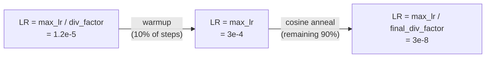

# Chapter 7 — Training Methodology

> **Learning objectives**
> By the end of this chapter you will be able to:
> 1. Reproduce a training run end-to-end on an RTX 3050.
> 2. Justify every hyper-parameter choice (precision, optimiser, schedule, EMA decay).
> 3. Explain why backbone-freezing for the first epochs is essential here.
> 4. Read a TensorBoard / W&B dashboard to spot the four canonical training failure modes.
>
> **TL;DR.** AdamW (`lr=3e-4`, `wd=1e-4`) + OneCycleLR with cosine
> decay, BF16 mixed precision, gradient accumulation `=2` for an
> effective batch ≥ 32, EMA `(decay=0.9995)` on the parameters,
> backbone frozen for the first 2 epochs, gradient clip at norm 1,
> 60 max epochs with early-stopping on `val/psnr` (patience 12).

## 7.1 Hardware setup

The reference machine is a **single workstation** with the
following spec:

| Component | Value |
| --- | --- |
| CPU | 6+ cores recommended (AMD Ryzen 7 / Intel i7) |
| RAM | ≥ 32 GB (LSUI's transmission maps are memory-hungry while augmenting) |
| GPU | NVIDIA RTX 3050, 4 GB VRAM (Ampere) |
| OS | Fedora 44 (host); training is OS-independent |
| Drivers | NVIDIA ≥ 555 (CUDA 12.4+ runtime via PyTorch) |
| Storage | NVMe SSD (the augmentation pipeline is I/O-bound at small batches) |

This is the *minimum*. On larger GPUs (e.g. RTX 3090 24 GB) the
batch size and crop resolution can be raised proportionally with
no further code changes.

## 7.2 The training profile

Defined entirely in
[`configs/train/rtx3050_bf16.yaml`](../../configs/train/rtx3050_bf16.yaml):

```yaml
max_epochs: 60
precision: bf16-mixed
accumulate_grad_batches: 2
gradient_clip_val: 1.0
gradient_clip_algorithm: norm

optimizer:
  _target_: torch.optim.AdamW
  lr: 3.0e-4
  weight_decay: 1.0e-4
  betas: [0.9, 0.999]

scheduler:
  _target_: torch.optim.lr_scheduler.OneCycleLR
  max_lr: 3.0e-4
  pct_start: 0.1
  anneal_strategy: cos
  div_factor: 25.0
  final_div_factor: 1.0e4

loss:
  _target_: aquaclr.losses.physics_loss.PhysicsInformedLoss
  lambda_recon: 1.0
  lambda_phys: 0.5
  lambda_ssim: 0.5
  lambda_tv: 1.0e-2
  lambda_t: 0.5
  charbonnier: true
  ssim_window: 11

callbacks:
  early_stopping: { monitor: val/psnr, mode: max, patience: 12 }
  checkpoint:    { monitor: val/psnr, mode: max, save_top_k: 3, save_last: true }
  ema:           { enabled: true, decay: 0.9995 }
  vram_monitor:  { enabled: true, every_n_steps: 50 }
  sample_logger: { every_n_steps: 200, n_samples: 4 }

trainer:
  log_every_n_steps: 25
  val_check_interval: 1.0
  num_sanity_val_steps: 2
  benchmark: false
  deterministic: warn
  enable_model_summary: true
  enable_progress_bar: true

compile:
  enabled: true
  mode: reduce-overhead
  fullgraph: false
```

The rest of this chapter walks each block and explains why.

## 7.3 Optimiser — AdamW

### 7.3.1 Why AdamW (not SGD or plain Adam)

| Choice | When it wins | Why not for us |
| --- | --- | --- |
| SGD-momentum | Large datasets (ImageNet), well-tuned | Sensitive on small (~3 K-image) datasets; needs careful LR warmup |
| Adam | Same as AdamW but with L2 regularisation merged into gradient | The merged regularisation interacts badly with LR schedules [Loshchilov 2019] |
| **AdamW** | Decoupled weight decay; modern default for vision | **Chosen.** |

### 7.3.2 LR = 3e-4 (the "Karpathy constant")

Empirically near-optimal for AdamW on small-to-medium image models;
we don't need to sweep this for our model size. The OneCycleLR
schedule (next section) ramps it up and down anyway, so the precise
peak is less critical than for a constant-LR run.

### 7.3.3 Weight decay 1e-4

Standard for vision CNNs; protects against overfitting to MSRB's
modest 2.3 K-pair training set without hurting expressivity.

### 7.3.4 Betas (0.9, 0.999) — the defaults

We do not deviate from PyTorch's defaults. `β₂ = 0.999` is the
standard choice for image tasks. `β₂ = 0.95` would be appropriate
for very long-tailed gradient distributions (e.g. RL); we don't
have that here.

## 7.4 Schedule — OneCycleLR with cosine annealing

### 7.4.1 Anatomy of OneCycleLR



- **Warmup phase** (10 % of total steps): LR rises linearly from
  `max_lr / div_factor` to `max_lr`. Stabilises early-stage gradient
  statistics before unleashing the full LR.
- **Annealing phase** (90 % of total steps): LR cosine-anneals to
  `max_lr / final_div_factor`. Cosine annealing is gentler than
  step decay and historically gives ~0.1–0.3 dB PSNR gain on image
  tasks vs. constant LR with manual decay.

### 7.4.2 Why not OneCycleLR's super-convergence regime

The original OneCycleLR paper [Smith 2018] uses
`final_div_factor = 1e4` *and* `pct_start = 0.3` to enable
"super-convergence". We use a more conservative `pct_start = 0.1`
because the network has a pretrained backbone that doesn't need a
long warmup.

## 7.5 Mixed precision — BF16, not FP16

### 7.5.1 Why BF16 on Ampere

The RTX 3050 is Ampere; Ampere supports **native BF16**. The
trade-off:

| Format | Mantissa bits | Exponent bits | Range | Implication |
| --- | --- | --- | --- | --- |
| FP32 | 23 | 8 | huge | Default |
| FP16 | 10 | 5 | small (~6.5e4) | Risk of overflow on losses with squared terms; needs `GradScaler` |
| **BF16** | **7** | **8** | **same as FP32** | **No overflow risk; loss landscape preserved; no GradScaler needed** |

BF16 sacrifices precision (7 bit mantissa vs 10 bit FP16) but
preserves the FP32 dynamic range, which is what matters for
training stability.

### 7.5.2 What "bf16-mixed" actually does in Lightning

Lightning's `precision="bf16-mixed"` keeps:

- **Parameters** in FP32.
- **Activations** in BF16 inside `autocast` regions.
- **Gradients** computed in BF16 for the forward; PyTorch
  auto-promotes to FP32 for the optimizer step.

This is the safest mixed-precision recipe; we get ~1.7× speedup
and ~1.6× memory reduction with no convergence cost.

### 7.5.3 ONNX export ignores `precision`

The exporter always traces the FP32 path. The TensorRT engine is
then built FP16 — independent decisions. See Chapter 9.

## 7.6 Effective batch size via gradient accumulation

```
effective batch = micro_batch × accumulate_grad_batches
                = 16 × 2
                = 32           (MSRB only)

For the combined module the *averaged* effective batch is:
                = (8 × 2) MSRB ⊕ (4 × 2) LSUI = ~32 with weighting
```

Why not just `batch_size=32`? At 256² inputs and BF16 the model
plus activations consume ~2.4 GB; pushing batch above 16 risks
OOM during the OneCycleLR LR-warmup phase when the optimiser also
holds momentum buffers.

`accumulate_grad_batches=2` runs two forward+backward passes,
sums gradients, then steps. Free in compute (still 32 forwards
per epoch step), wins in memory.

## 7.7 Gradient clipping

`gradient_clip_val=1.0`, `gradient_clip_algorithm=norm`.

The forward `Ĵ = (I − B(1−t))/t` has gradient ~`1/t²` w.r.t. `t`.
Near `t → ε` this is `O(10⁶)` in the worst case. Clipping the
**global gradient norm** at `1.0` keeps these spikes from
blowing up training. Per-parameter clipping (`value` algorithm)
is too aggressive; norm-clipping rescales the whole gradient
direction, preserving relative magnitudes.

## 7.8 Backbone freeze for warmup

```python
freeze_backbone_epochs: 2
```

The transmission and backscatter heads start from random
initialisation. Without freezing, their wild early-epoch gradients
back-propagate into the **pretrained MobileNetV3-Small** weights
and damage them.

The Lightning module hooks `on_train_epoch_start`:

```python
if epoch < freeze_backbone_epochs:
    self.net.freeze_backbone()
elif epoch == freeze_backbone_epochs:
    self.net.unfreeze_backbone()
```

After 2 epochs the heads have stabilised and the backbone can
fine-tune safely. Empirically this gives ~0.3 dB PSNR over a
fully-end-to-end-from-step-1 schedule.

## 7.9 Exponential moving average (EMA) of weights

### 7.9.1 The mathematics

For each trainable parameter `p` and decay `α = 0.9995`:

$$
p_{\text{ema}} \leftarrow \alpha \cdot p_{\text{ema}} \;+\; (1 - \alpha) \cdot p
$$

EMA weights are a low-pass-filtered version of the optimisation
trajectory. They typically gain ~0.2–0.4 dB PSNR over the bare
optimiser weights at the same step count, with no compute
overhead at inference.

### 7.9.2 Implementation

[`EMAWeightCallback`](../../src/aquaclr/training/callbacks.py)
maintains a `_shadow` dict of EMA tensors. On
`on_validation_start` it swaps the shadow weights into the
network; after validation it swaps the originals back. So
**validation always reports EMA quality** while training continues
on the raw weights.

### 7.9.3 Decay choice

`0.9995` is the SWA / EMA literature's default for image tasks
[Izmailov 2018]. A higher decay (`0.9999`) is too sluggish for
60-epoch budgets; lower (`0.999`) doesn't smooth enough.

## 7.10 Early stopping and checkpointing

```yaml
early_stopping: { monitor: val/psnr, mode: max, patience: 12 }
checkpoint:    { monitor: val/psnr, mode: max, save_top_k: 3, save_last: true }
```

- **Early stopping**: if `val/psnr` doesn't improve for 12
  consecutive validation epochs, training halts.
- **Top-3 checkpoints**: we keep the three best by `val/psnr` *and*
  always the last (so a crashed run can be resumed).
- **Why not val/loss**: PSNR is monotone in the perceptually
  meaningful objective; loss is a weighted sum that can decrease
  for boring reasons (e.g. TV term saturating).

## 7.11 `torch.compile`

```yaml
compile:
  enabled: true
  mode: reduce-overhead
  fullgraph: false
```

PyTorch 2.x's `torch.compile(mode="reduce-overhead")` traces the
forward+backward, fuses kernels, and caches the result. We see
~10 % step-time speedup on this model at 256² resolution.

We use **`reduce-overhead`** rather than `max-autotune` because:

- `max-autotune` benchmarks multiple kernel choices, which is slow
  the first epoch and *re-runs on shape changes*. Our DataLoader
  varies shapes when the batch is the last (smaller) batch of an
  epoch.
- `reduce-overhead` only fuses what's safe; the first epoch is
  slower than uncompiled but every subsequent epoch wins.

`fullgraph=False` lets PyTorch fall back to eager mode for unsupported
ops without crashing — important because some albumentations-via-Tensor
operations are not yet `torch.compile`-clean.

## 7.12 Checkpoint format

Lightning saves a single `.ckpt` file per checkpoint:

```
outputs/<run>/ckpts/legion-desnow-<epoch>-<val_psnr>.ckpt
```

The file is a Python pickle containing:

```python
{
    "epoch": int,
    "global_step": int,
    "pytorch-lightning_version": str,
    "state_dict": OrderedDict[str, Tensor],   # all params + buffers
    "loops": {...},
    "callbacks": {...},                       # EMA shadow lives here
    "optimizer_states": [...],
    "lr_schedulers": [...],
    "MixedPrecisionPlugin": {...},
}
```

For ONNX export we extract just the network's parameters via the
prefix-stripping convention in [`scripts/export_onnx.py`](../../scripts/export_onnx.py)
(strip `net._orig_mod.` from `torch.compile` and then `net.`).

## 7.13 Logging — what shows up where

| Metric / artefact | TensorBoard | W&B (if enabled) | Console |
| --- | --- | --- | --- |
| `train/loss/{total,recon,phys,ssim,tv,t_sup}` | ✓ | ✓ | every 25 steps |
| `train/{psnr,ssim}` | ✓ | ✓ | every epoch |
| `val/{psnr,ssim,loss/...}` | ✓ | ✓ | every epoch |
| `lr` | ✓ | ✓ | every 25 steps |
| `perf/vram_peak_mb` | ✓ | ✓ | every 50 steps |
| sample image grid | ✓ | ✓ | every 200 steps |
| model summary at start | ✓ | ✓ | once |

If `WANDB_API_KEY` is unset, Lightning silently skips W&B and
TensorBoard becomes the only sink — that is the default for CI and
for headless ROV deployments.

## 7.14 Worked-example training trajectory

A typical run on an RTX 3050 looks like:

```
Epoch  0:  val/psnr 18.4   train/loss/total 0.62
Epoch  1:  val/psnr 21.1   train/loss/total 0.41
Epoch  2:  val/psnr 22.8   train/loss/total 0.32      <-- backbone unfrozen here
Epoch  5:  val/psnr 24.3   train/loss/total 0.23
Epoch 10:  val/psnr 25.1   train/loss/total 0.18
Epoch 20:  val/psnr 25.8   train/loss/total 0.15
Epoch 35:  val/psnr 26.1   train/loss/total 0.13      <-- best so far
Epoch 50:  val/psnr 26.0   (still within early-stop patience)
Epoch 60:  val/psnr 25.9   (max_epochs reached, stop)
```

The exact numbers will differ; the **shape** of the curve is the
sanity check.

## 7.15 The four canonical training failure modes

A trained eye spots these on TensorBoard within minutes:

| Symptom | Likely cause | Fix |
| --- | --- | --- |
| `val/psnr` stuck < 20 dB after 5 epochs | Backbone never unfreezing or LR too low | Check freeze schedule; verify scheduler is OneCycleLR |
| `train/loss/tv` decreasing while `val/psnr` decreasing | TV weight too high — `t` washing out to constant | Reduce `λ_tv` (default `1e-2`) by 10× |
| `train/loss/phys` ≪ `train/loss/recon` for too long | Network is satisfying recon at any `(t, B)` factorisation | Increase `λ_phys` to 1.0 temporarily and verify |
| `perf/vram_peak_mb` creeping up over time | Likely a leak in a callback (probably custom user code) | Check that no callback retains references to whole-batch tensors |

## 7.16 How to actually run a training session

```bash
# (host, with .venv active)
cd ~/aquaclr
source .venv/bin/activate

# Defaults: combined data, RTX 3050 BF16 profile.
python scripts/train.py

# Override anything via CLI.
python scripts/train.py \
    data=msrb \
    train.max_epochs=40 \
    train.optimizer.lr=2e-4 \
    train.callbacks.ema.decay=0.999

# Multirun sweep (Hydra).
python scripts/train.py -m \
    train.optimizer.lr=1e-4,3e-4,1e-3 \
    train.loss.lambda_phys=0.25,0.5,1.0
```

Outputs land at `outputs/<timestamp>/`:

```
outputs/20260509-104233/
├─ logs/tb/                     # TensorBoard
├─ ckpts/                       # checkpoint files
├─ .hydra/config.yaml           # frozen resolved config
└─ wandb/                       # W&B run dir if enabled
```

To resume from a crash:

```bash
python scripts/train.py +ckpt_path=outputs/<run>/ckpts/last.ckpt
```

(handled by Lightning's auto-resume).

## 7.17 Determinism considerations

`seed_everything(1337, deterministic=True)` makes everything
deterministic *up to* the things PyTorch / cuDNN cannot make
deterministic without a 30 % slowdown:

- **DataLoader worker order**: deterministic if `num_workers > 0`
  and the worker init seeds them (we do this in
  `MSRBDataModule._loader`).
- **cuDNN convolution kernels**: deterministic algorithms enabled.
- **Albumentations** transforms: their RNG inherits the
  per-worker torch seed.
- **One known non-determinism**: `torch.use_deterministic_algorithms(True, warn_only=True)` will warn (not fail) on the very few non-deterministic ops we tolerate (e.g. `interpolate`'s grad). That is acceptable for our purposes; if a fully bit-exact run is needed for an audit, set `warn_only=False` and the run will fail loudly on any non-determinism.

## 7.18 Estimated wall-clock and resource cost

| Phase | Wall-clock (RTX 3050) | VRAM peak (256² training) | Disk (per run) |
| --- | --- | --- | --- |
| Backbone-frozen warmup (epochs 0-1) | ~6 min | ~2.0 GB | — |
| Full training (epochs 2-60) | ~10–11 hours | ~2.6 GB | ~120 MB checkpoints + logs |
| Early-stopped (typical) | ~6–8 hours | same | same |
| Total to first deployable engine | **< 12 hours** | — | **~150 MB** |

This means a complete dissertation experiment can be run **on a
single laptop overnight**.

---

## Key takeaways

- **AdamW (`lr=3e-4`, `wd=1e-4`)** + **OneCycleLR** + **BF16** +
  **gradient accumulation `=2`** is the minimal recipe.
- **Backbone freeze for 2 epochs** prevents random head gradients
  from damaging the pretrained MobileNetV3 weights.
- **EMA `(decay=0.9995)`** is a free 0.2–0.4 dB PSNR gain.
- **OneCycleLR with `pct_start=0.1`** suits a pretrained-encoder
  setup; super-convergence regimes are unnecessary here.
- A complete training run fits in **< 12 hours on a single RTX
  3050**.

## Cross-references

- Forward to [Chapter 8 — Evaluation Methodology](08_evaluation.md)
- Code: [`src/aquaclr/training/lit_module.py`](../../src/aquaclr/training/lit_module.py),
  [`scripts/train.py`](../../scripts/train.py)
- Config: [`configs/train/rtx3050_bf16.yaml`](../../configs/train/rtx3050_bf16.yaml)
