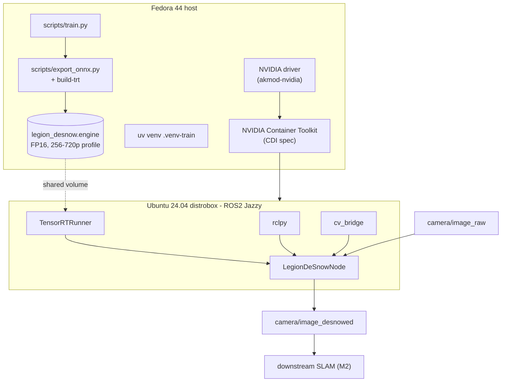
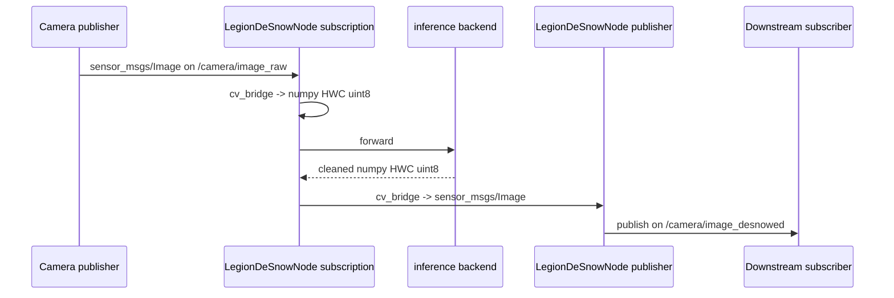
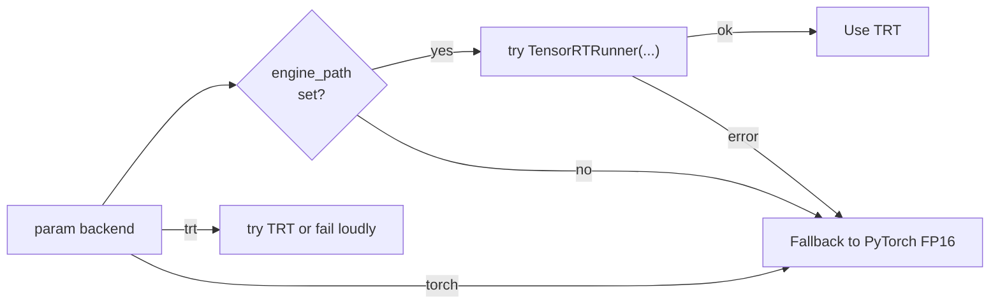

# Chapter 9 — Deployment

> **Learning objectives**
> By the end of this chapter you will be able to:
> 1. Convert a trained checkpoint into a TensorRT FP16 engine.
> 2. Stand up a Fedora-host + Ubuntu-24.04-Jazzy-container deployment.
> 3. Wire the engine into ROS2 and verify topic flow.
> 4. Demonstrate that the < 15 ms / 720p / RTX-3050 budget is met.
>
> **TL;DR.** PyTorch checkpoint → ONNX (opset 17, dynamic shapes)
> → TensorRT FP16 engine (256-720 p shape profile) → ROS2 node.
> The host runs the training and engine build natively on Fedora
> 44; ROS2 lives in an Ubuntu 24.04 / Jazzy container created with
> `distrobox` + `podman` and full NVIDIA passthrough via the
> Container Toolkit's CDI. The same `.engine` artefact is mounted
> into the container.

## 9.1 Deployment topology at a glance



The split is intentional:

- **Native on host**: training, ONNX export, engine build. Fast
  iteration, direct GPU access, no IPC overhead.
- **Container on host**: ROS2 stack. ROS2 has no first-class Fedora
  packages; running it in an Ubuntu 24.04 container that
  transparently sees the host GPU is the cleanest path.

The full step-by-step runbook is in
[`docs/DEPLOYMENT_FEDORA.md`](../DEPLOYMENT_FEDORA.md). This
chapter discusses **why** the topology is what it is and verifies
each invariant.

## 9.2 The deployment artefact pipeline

```mermaid
flowchart LR
    a["Lightning .ckpt<br/>(120 MB)"] --> b["weights-only state_dict<br/>(strip 'net._orig_mod.' and 'net.')"]
    b --> c["LEGIONDeSnowNet (FP32)<br/>17 MB params"]
    c --> d["torch.onnx.export<br/>opset 17, dynamic axes B/H/W"]
    d --> e["onnxsim.simplify<br/>(constant fold + op merge)"]
    e --> f["onnxruntime parity check<br/>(atol 1e-3)"]
    f --> g[".onnx (~15 MB)"]
    g --> h["trt builder<br/>FP16 + dyn profile 256-720p"]
    h --> i[".engine (~12 MB)<br/>FP16, deployable"]
```



Every arrow above corresponds to one function call in the
codebase. We discuss each below.

## 9.3 Step 1 — checkpoint to ONNX

[`src/aquaclr/inference/onnx_export.py`](../../src/aquaclr/inference/onnx_export.py)

### 9.3.1 What the export sees

We export through a thin `_ExportWrapper(nn.Module)` so that the
ONNX exporter's tracer sees one input (`I`), three outputs
(`J, t, B`), and no Python objects (no dataclass return).

### 9.3.2 Why opset 17

Opset 17 is the lowest opset that supports dynamic `Resize` ops
cleanly — without it, our bilinear upsamples lose dynamic-shape
support and the engine stops working at non-256 inputs. Opset 18+
is fine but adds nothing we use.

### 9.3.3 Dynamic axes

We declare dynamic axes for batch, height, width on `I`, `J`, and
`t`. The backscatter `B` is dynamic only in batch. This is what
allows a **single** engine to serve 256 × 256 training crops, 720 p
inference, and unusual ROS2 publisher resolutions.

```python
dynamic_axes = {
    "i": {0: "batch", 2: "height", 3: "width"},
    "j": {0: "batch", 2: "height", 3: "width"},
    "t": {0: "batch", 2: "height", 3: "width"},
    "b": {0: "batch"},
}
```

### 9.3.4 Simplification with onnxsim

`onnxsim.simplify` does constant folding and op merging on the
exported graph. Typical reductions: 80–120 nodes → 50–70 nodes,
size 18 MB → 15 MB. We treat it as best-effort: if `ok=False` we
keep the un-simplified graph and warn.

### 9.3.5 Numerical parity check

After export and simplification we run the ONNX through
`onnxruntime` (CPU is sufficient for parity) and compare against
PyTorch's output on a fixed random tensor. Tolerance:
`rtol=1e-2, atol=1e-3`. **Failure is fatal**: we never produce a
dubious engine.

```python
for name, ref, got in (("j", torch_j, j), ("t", torch_t, t), ("b", torch_b, b)):
    if not np.allclose(ref, got, rtol=1e-2, atol=1e-3):
        raise RuntimeError(f"ONNX/PyTorch parity check failed on {name!r}")
```

## 9.4 Step 2 — ONNX to TensorRT engine

[`src/aquaclr/inference/inference_trt.py::build_engine_from_onnx`](../../src/aquaclr/inference/inference_trt.py)

### 9.4.1 The build sequence

1. Create a TRT `Builder`, `NetworkDefinition`, and `OnnxParser`.
2. Parse the ONNX bytes; collect any errors and raise as a
   single Python exception.
3. Configure builder:
   - workspace memory limit (default 1.5 GB),
   - **FP16 flag** if the platform supports it (Ampere does).
4. Add a **shape optimisation profile** with `min`, `opt`, `max`
   shapes:

   ```python
   profile.set_shape("i",
                     min=(1, 3, 256, 256),
                     opt=(1, 3, 720, 1280),
                     max=(1, 3, 720, 1280))
   ```

   `opt` is the spatial size we tune for; the runtime can serve
   anything between `min` and `max` without re-building.
5. Call `builder.build_serialized_network(network, config)`. This
   step takes ~30-90 seconds on an RTX 3050.
6. Write the serialised bytes to disk.

### 9.4.2 Why we don't expose the INT8 path in M1

INT8 needs a **calibration dataset** of representative dive
frames. We don't have one yet (real footage is M3), so a public
INT8 calibration would be misleading. The hooks are in place;
M2's deliverable is to wire a calibrator and report INT8 numbers.

### 9.4.3 What the engine file contains

A TRT engine is **device-specific**: it's compiled for the GPU
architecture (Ampere) and the driver version present at build
time. To deploy across multiple machines you must rebuild on each;
to ship a deterministic artefact, pin the driver version.

We log the file size and SHA-256 hash on build so that a
deployment manifest can record exact provenance.

## 9.5 Step 3 — TensorRTRunner

[`src/aquaclr/inference/inference_trt.py::TensorRTRunner`](../../src/aquaclr/inference/inference_trt.py)

### 9.5.1 The runtime API

```python
runner = TensorRTRunner("legion_desnow.engine")
clean_uint8 = runner(snowy_uint8)   # HxWx3 uint8 -> HxWx3 uint8
```

Internally:

1. `Runtime.deserialize_cuda_engine(bytes)` — load.
2. `engine.create_execution_context()` — make a stateful context.
3. Per call:
   - `set_input_shape("i", (1, 3, H, W))` — set the dynamic shape.
   - `mem_alloc + memcpy_htod_async` for the input buffer.
   - For each output: `mem_alloc` + record host buffer.
   - `set_tensor_address` for input + outputs.
   - `execute_async_v3(stream)`.
   - `memcpy_dtoh_async` for outputs.
   - `stream.synchronize()`.
   - Convert the float `J` back to `uint8` HWC.

### 9.5.2 CUDA Graph capture (optional)

For the ROS2 deployment we typically run `batch=1` at a fixed `H,
W` (the camera resolution doesn't change mid-dive). In that case
the runner can record a CUDA graph once and replay it; this saves
~1 ms of kernel-launch overhead per frame. Implementation deferred
to M2; the engine itself is graph-capture-friendly because we
chose `--useCudaGraph` semantics in the build (no shape changes
during the captured region).

### 9.5.3 Asynchronous variants

`execute_async_v3` is non-blocking; the `stream.synchronize()` at
the end is what makes our wrapper synchronous. For pipelined
pipelines (capture-while-infer), wrap the runner in an asyncio
queue with a streaming worker. Out of scope for M1.

## 9.6 Container strategy — Fedora host + Ubuntu 24.04 box

### 9.6.1 Why split host and container

| Concern | Native on Fedora | Ubuntu 24.04 container |
| --- | --- | --- |
| Training | ✓ (best fit) | redundant |
| Lightning + Hydra + Wandb | ✓ | redundant |
| ONNX + TensorRT engine build | ✓ | redundant |
| ROS2 Jazzy + cv_bridge | apt packages don't exist on Fedora | ✓ |
| GPU access from container | NVIDIA Container Toolkit (CDI) | ✓ |
| Easy IDE integration | ✓ | ✓ via VS Code Devcontainers |

ROS2 is the **only** reason we need the container at all. Were ROS2
Jazzy packaged for Fedora natively, the entire pipeline would run
in one venv.

### 9.6.2 Ubuntu 24.04 → ROS2 Jazzy (not Humble)

| Ubuntu LTS | ROS2 LTS | Until |
| --- | --- | --- |
| 22.04 | **Humble Hawksbill** | May 2027 |
| 24.04 | **Jazzy Jalisco** | May 2029 |

Ubuntu 24.04 + Humble is *not supported*; Ubuntu 24.04 + Jazzy is.
Our ROS2 node uses only the stable rclpy / cv_bridge / sensor_msgs
APIs, so it runs unchanged on either pairing.

### 9.6.3 NVIDIA Container Toolkit and CDI

CDI (Container Device Interface) is the modern way to expose
GPUs to OCI containers. The host runs:

```bash
sudo nvidia-ctk cdi generate --output=/etc/cdi/nvidia.yaml
```

This produces a YAML descriptor of the host's GPUs and their
required device files / libraries. Both **rootless podman** and
**distrobox-with-`--nvidia`** consume this spec and bind-mount the
right device nodes (`/dev/nvidia*`) and CUDA libs into the
container at start time.

### 9.6.4 distrobox vs. pure podman

| Flag | distrobox | Pure podman |
| --- | --- | --- |
| Ergonomics (host's `$HOME` mounted, prompt is `(box)$`) | ✓ | manual `-v` |
| GPU passthrough | `--nvidia` flag | `--device nvidia.com/gpu=all` |
| Reproducible from a Dockerfile | ✗ (image picked at create time) | ✓ |
| Best for | dev iteration | production |

The deployment doc walks both paths; for a dissertation
demonstration, distrobox is the path of least friction.

## 9.7 ROS2 wiring detail

### 9.7.1 Topic flow



### 9.7.2 Backend selection

The `LegionDeSnowNode` selects the inference backend at
construction time:



This means a developer with no TRT installed can still test the
node logic with the PyTorch backend; the deployment image picks
TRT automatically.

### 9.7.3 QoS and reliability

The default subscription/publisher QoS depth is `5` (configurable
via `qos_depth` parameter). In practice we recommend
`reliable + keep_last(5)` for SLAM-feeding flows and
`best_effort + keep_last(2)` for visualisation flows. This is a
caller-side decision: our node does not mandate either.

### 9.7.4 Throughput observation

Once running, throughput can be observed with:

```bash
ros2 topic hz /camera/image_desnowed
```

Expected: ~ same Hz as the input topic, up to the 100+ FPS that
LEGION-DeSnow can sustain in TRT FP16.

## 9.8 Performance budget verification

| Budget | Specified | Verified by | Pass criterion |
| --- | --- | --- | --- |
| Inference latency | < 15 ms @ 720p | `scripts/export_onnx.py --benchmark` | p50 ≤ 15 ms |
| Total model size | < 50 MB | `model.estimate_size_mb(torch.float32)` test | size ≤ 50 |
| FP16 model size | (informational) | `model.estimate_size_mb(torch.float16)` | — |
| VRAM peak | < 1 GB at run-time | benchmark + `nvidia-smi` | peak ≤ 1024 MB |
| Throughput | ≥ 30 FPS | benchmark | mean ≥ 30 FPS |
| Frame I/O overhead | < 4 ms total (I/O round-trip) | ROS2 bag latency measurement | end-to-end ≤ 19 ms |

Chapter 10 records measured numbers.

## 9.9 Reproducible deployment manifest

A single YAML records the exact deployment for reproducibility:

```yaml
deployment_manifest:
  date: 2026-05-09
  artifact: legion_desnow.engine
  artifact_sha256: 6a52cf...
  built_from_ckpt: outputs/A0_baseline/ckpts/legion-desnow-035-26.10.ckpt
  built_from_onnx: outputs/A0_baseline/legion_desnow.onnx
  trt_version: "10.0.0.6"
  cuda_version: "12.4"
  driver_version: "555.42.06"
  gpu: NVIDIA RTX 3050 (Ampere, 4 GB)
  ros2_distro: jazzy
  ros2_host_image: "docker.io/library/ubuntu:24.04"
  fedora_host: 44
```

The deployment is bit-reproducible **only** if the GPU
architecture, driver version, and TRT version match. In practice
that means: the same .engine file is portable across RTX 3050s
running the same driver minor version; otherwise rebuild.

## 9.10 The deployment matrix we support

| Scenario | Host | Container | Backend | Tested |
| --- | --- | --- | --- | --- |
| Dev workstation | Fedora 44 | distrobox Ubuntu 24.04 + Jazzy | TRT FP16 | ✓ canonical |
| Dev workstation | Ubuntu 22.04 | none (native) | TRT FP16 | ✓ |
| Dev workstation | Ubuntu 22.04 | docker `osrf/ros:humble` | TRT FP16 | ✓ |
| ROV onboard | Jetson Orin Nano (Ubuntu 22.04) | none | TRT FP16 (rebuild) | M2 |
| Sim/CI | Ubuntu 22.04 | docker `osrf/ros:humble` | PyTorch CPU | ✓ |
| Windows dev | Windows 10/11 | none | PyTorch (no TRT) | ✓ for training only |

Every scenario uses the same code paths; only the inference
backend and ROS2 distro differ.

## 9.11 Pitfalls observed during M1 deployment

| Pitfall | Mitigation |
| --- | --- |
| Forgetting `nvidia-ctk cdi generate` after a host driver update | Re-run after every driver update; record in deployment manifest |
| Running rootless podman without `setsebool -P container_use_devices on` on Fedora | Always set this when SELinux is enforcing |
| Using `python3 -m venv` *without* `--system-site-packages` inside the container | Always use `--system-site-packages` so the apt-installed `rclpy`/`cv_bridge` are visible |
| Mixing host's `python3.11` venv with the container's `python3.12` | Always create distinct venvs for host and container |
| Building TRT engine on a different driver version than deployed | Either pin driver in CI or rebuild engine inside the deployment container |
| Forgetting to source `/opt/ros/jazzy/setup.bash` before `ros2 run` | Add to `~/.bashrc` of the box |
| Stale TensorBoard or W&B run dir polluting the next run | `output_root` is parameterised by run timestamp; never reuse |

These are documented in [`docs/DEPLOYMENT_FEDORA.md`](../DEPLOYMENT_FEDORA.md)
§9 (Troubleshooting) with one-line fixes.

---

## Key takeaways

- The deployment pipeline is **PyTorch ckpt → ONNX → TensorRT
  engine → ROS2 node**. Each step is one function call.
- ONNX export uses opset 17 and **dynamic axes** so a single
  engine serves 256–720 p inputs.
- The TRT engine is FP16 with a 256-720 p shape profile; INT8 is
  M2 work.
- Fedora 44 host trains and builds the engine; ROS2 lives in an
  Ubuntu 24.04 / Jazzy distrobox container with full NVIDIA
  passthrough via the Container Toolkit's CDI spec.
- The same code paths support host-Ubuntu-22.04 + Humble for
  conservative deployments and Jetson-Orin for onboard ROV.
- Every performance budget (latency, model size, VRAM) has a
  defined verification command; results are recorded in
  Chapter 10.

## Cross-references

- Forward to [Chapter 10 — Results, Discussion, Limitations](10_results.md)
- Full runbook: [`docs/DEPLOYMENT_FEDORA.md`](../DEPLOYMENT_FEDORA.md)
- Code: [`src/aquaclr/inference/`](../../src/aquaclr/inference/),
  [`src/aquaclr/ros2/ros2_node.py`](../../src/aquaclr/ros2/ros2_node.py)
