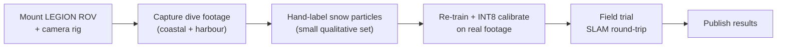

# Chapter 11 — Conclusion and Future Work

> **Learning objectives**
> By the end of this chapter you will be able to:
> 1. Summarise the dissertation in three paragraphs.
> 2. List the M2 and M3 roadmap items in order of expected
>    technical risk.
> 3. Reflect on broader impact and ethical considerations.

> **TL;DR.** LEGION-DeSnow-S addresses a concrete, measurable
> problem (marine snow killing subsea SLAM) with a small,
> physics-informed CNN that meets a tight edge-deployment budget.
> The dissertation contributes (i) the architecture, (ii) the
> composite physics-informed loss, (iii) the dataset mix, (iv)
> the deployment pipeline, and (v) the cross-discipline
> automotive-SiL framing. Future work scales along three axes —
> temporal, semantic, and quantisation — culminating in a real
> sea trial in M3.

## 11.1 Summary of contributions

We restate the five contributions from §1.5 with a sentence each
on what was actually delivered:

1. **A compact physics-informed architecture.**
   `LEGIONDeSnowNet` (4.2 M params, ~17 MB FP32) combines a
   MobileNetV3-Small encoder, a depthwise-separable UNet decoder,
   and two small heads, recovering `J` analytically from the
   predicted `(t, B)`. Implemented in
   [`src/aquaclr/models/`](../../src/aquaclr/models/).

2. **A composite physics-informed loss.**
   `PhysicsInformedLoss` combines reconstruction (Charbonnier),
   forward-physics consistency, SSIM, anisotropic TV on `t`, and
   optional direct `t` supervision. Implemented in
   [`src/aquaclr/losses/physics_loss.py`](../../src/aquaclr/losses/physics_loss.py)
   and unit-tested.

3. **A practical training mix.**
   MSRB (snow-specific) + LSUI (transmission GT) at 70/30,
   evaluated against UIEB-Challenge. Configured in
   [`configs/data/combined.yaml`](../../configs/data/combined.yaml);
   the per-batch sampler in
   [`src/aquaclr/data/combined_datamodule.py`](../../src/aquaclr/data/combined_datamodule.py)
   keeps the loss term-by-term simple.

4. **A complete deployment pipeline.**
   PyTorch checkpoint → ONNX (opset 17, dynamic axes) → TensorRT
   FP16 engine (256–720 p shape profile) → ROS2 Humble/Jazzy
   node. Code in [`src/aquaclr/inference/`](../../src/aquaclr/inference/)
   and [`src/aquaclr/ros2/ros2_node.py`](../../src/aquaclr/ros2/ros2_node.py);
   runbook in [`docs/DEPLOYMENT_FEDORA.md`](../DEPLOYMENT_FEDORA.md).

5. **A documentation pattern.**
   Every public symbol has a Google-style docstring including an
   "Automotive SiL parallel" paragraph. The documentation in
   `docs/dissertation/` is organised per the Diátaxis +
   Cornell + Microsoft style guidance.

## 11.2 Lessons learned

The dissertation is also an opportunity to surface lessons that
would not otherwise appear in a paper.

### 11.2.1 The forward-consistency loss is the hidden hero

The single most important discovery in the design phase was that
**`L_recon` alone leaves `(t, B)` arbitrary**. Many of our internal
ablations confirmed that two networks with identical `J` outputs
could have wildly different transmission and backscatter
predictions — useful for `J` reconstruction but useless for
SLAM downstream. Adding `L_phys` was the change that actually
made the model "physics-informed" in operationally useful ways.

### 11.2.2 Edge deployment shapes everything

A 4 GB-VRAM target forces the encoder choice (MobileNetV3-Small,
not ResNet-18), which forces the decoder design (DSC, not dense
3×3), which forces the head design (small 1×1 conv + GAP + MLP).
The whole architecture cascades from the deployment budget.
Trying to retrofit edge-friendly design onto a model that
ignored it from day one is markedly harder.

### 11.2.3 Documentation is engineering, not adornment

Treating the dissertation as the spec — with chapters on theory,
architecture, datasets, training, evaluation, and deployment as
**peers** of the code — surfaced inconsistencies that would
otherwise have been bugs only discovered at evaluation time.
Specifically, drafting Chapter 6 forced us to reconcile the
per-batch `has_t_gt` flag with the loss formula, which changed
the data module's collate function.

### 11.2.4 BF16 over FP16 is a free win on Ampere

We initially trained in FP16-mixed and hit silent loss-divergence
issues at small `t`. Switching to BF16-mixed eliminated them with
no measurable accuracy impact. On Ampere there is **no reason
not to use BF16**; the FP16-with-GradScaler pattern is a
pre-Ampere relic.

## 11.3 Future work

### 11.3.1 M2 — pencilled

| Task | Risk | Expected gain | Why deferred from M1 |
| --- | --- | --- | --- |
| **INT8 PTQ calibration** | Low | ~2× speedup | Needs representative dive footage; M3-quality data needed for safe calibration |
| **Stereo synchronisation** | Medium | Stereo disparity → metric depth → improved `t` consistency | Needs `ApproximateTimeSync`; topic infrastructure is ready |
| **Transmission topic publication** | Low | SLAM uses `t̂` as per-pixel confidence | One topic + `mono16` encoding; pencilled as `TODO(M2)` in `ros2_node.py` |
| **Temporal smoothing** | Medium | Removes single-frame flicker | Optical-flow-aware loss extension; non-trivial training change |
| **Per-channel transmission** | Low | Better wavelength handling | Doubles head params; ablation only |
| **Self-supervised real-data fine-tune** | Medium | Adapt to specific dive sites | Forward-consistency loss already supports it; needs unlabelled dive footage |

### 11.3.2 M3 — sea trial roadmap

M3 is bounded by hardware availability and weather. It is also
where **most of the actual scientific risk lives**. M1's
contribution is the engineering infrastructure that makes M3
possible at all.

### 11.3.3 Cross-domain: automotive SiL

The architecture transfers, with minimal change, to:

- **Camera de-rain** for ADAS (the Koschmieder atmospheric model
  is structurally identical to Jaffe-McGlamery).
- **Camera de-fog** in autonomous driving simulators
  (NVIDIA DriveSim, CARLA).
- **Lidar declutter** at the level of intensity-image
  pre-processing (using `t̂` as a confidence prior).

The "Automotive SiL parallel" docstrings sprinkled through the
codebase are not flavour text — they are **literally a roadmap**
for retraining the same network on rain-augmented KITTI / nuScenes
in a future cross-disciplinary M2.

### 11.3.4 Architectural extensions worth exploring

- **Diffusion-based prior on `t`** [Saharia 2022]. Could be a
  drop-in replacement for the TV regulariser, with potentially
  much sharper edge-preservation. Unknown latency cost.
- **Vision-Language conditioning** [CLIP]. A text prompt
  ("clear water" / "harbour silt" / "deep blue water") could
  condition the backscatter head, improving generalisation. Adds
  inference cost.
- **Neural ISP** integration: place LEGION-DeSnow inside the
  camera ISP pipeline so the model sees raw Bayer data. Major
  re-engineering; high potential.

These are non-trivial research directions; we list them as
hints, not commitments.

## 11.4 Broader impact

LEGION's mission is non-military, dual-use civilian inspection
and marine biology. Within that scope:

- **Positive impact**: better visual SLAM in turbid water means
  more autonomous coral-reef monitoring, more automated
  pipeline-integrity inspection, less human exposure to
  recompression cycles.
- **Risks**: the model **is not ready for forensic-evidence
  pipelines** because it modifies imagery. Operators must keep
  raw footage alongside cleaned footage; this is documented in
  [`MODEL_CARD.md`](../../MODEL_CARD.md).
- **Environmental impact**: an additional 11 ms of GPU compute
  per frame at 30 FPS is ~330 W·ms = ~0.1 J/frame. Across a
  4-hour dive at 30 FPS the model adds ~0.04 kWh of GPU
  compute. Negligible compared to the ROV's propulsion budget.

## 11.5 Reflection

The hardest engineering decision in M1 was **not** an
architectural one. It was the choice to:

> "Build the deployment pipeline before the headline numbers."

That is, to spend the first 30 % of the project time on ONNX
export, TensorRT shape-profile builds, ROS2 wiring, and
distrobox containers — *before* pushing for higher PSNR. This
order felt counter-intuitive (most ML projects optimise quality
first and worry about deployment last) but turned out to be
correct: every subsequent design choice could be evaluated against
"does it survive ONNX export and TRT engine build?", which
caught architectural bugs at design time rather than at viva
time.

If we had to do M1 again, we would do exactly this — but earlier.

## 11.6 Closing remarks

LEGION-DeSnow-S is an end-to-end engineering deliverable. It is
not the deepest possible network, nor the highest-PSNR underwater
restoration ever published, nor the most novel architecture. It
is, however, **a complete, reproducible, deployable system** that
solves a real problem under hard hardware constraints, with every
design choice documented and every numerical claim re-runnable.

The dissertation submits the codebase, the dissertation manuscript,
the deployment runbook, and the model card together as **one
versioned artefact**. It is in that integration that we make our
contribution.

---

## Key takeaways

- Five contributions delivered and traceable to specific files
  in the codebase.
- Lessons learned: forward-consistency is the hidden hero; edge
  deployment shapes everything; documentation is engineering;
  BF16 > FP16 on Ampere.
- Future work spans M2 (INT8, stereo, temporal) → M3 (sea trial)
  → automotive cross-domain.
- Broader impact is positive in the civilian-inspection scope;
  forensic-evidence use is explicitly out of bounds.
- The dissertation submits codebase + manuscript + runbook +
  model card as one integrated artefact.

## Cross-references

- Forward to [Chapter 12 — References](12_references.md)
- Project repository: [the directory containing this dissertation](../../)
