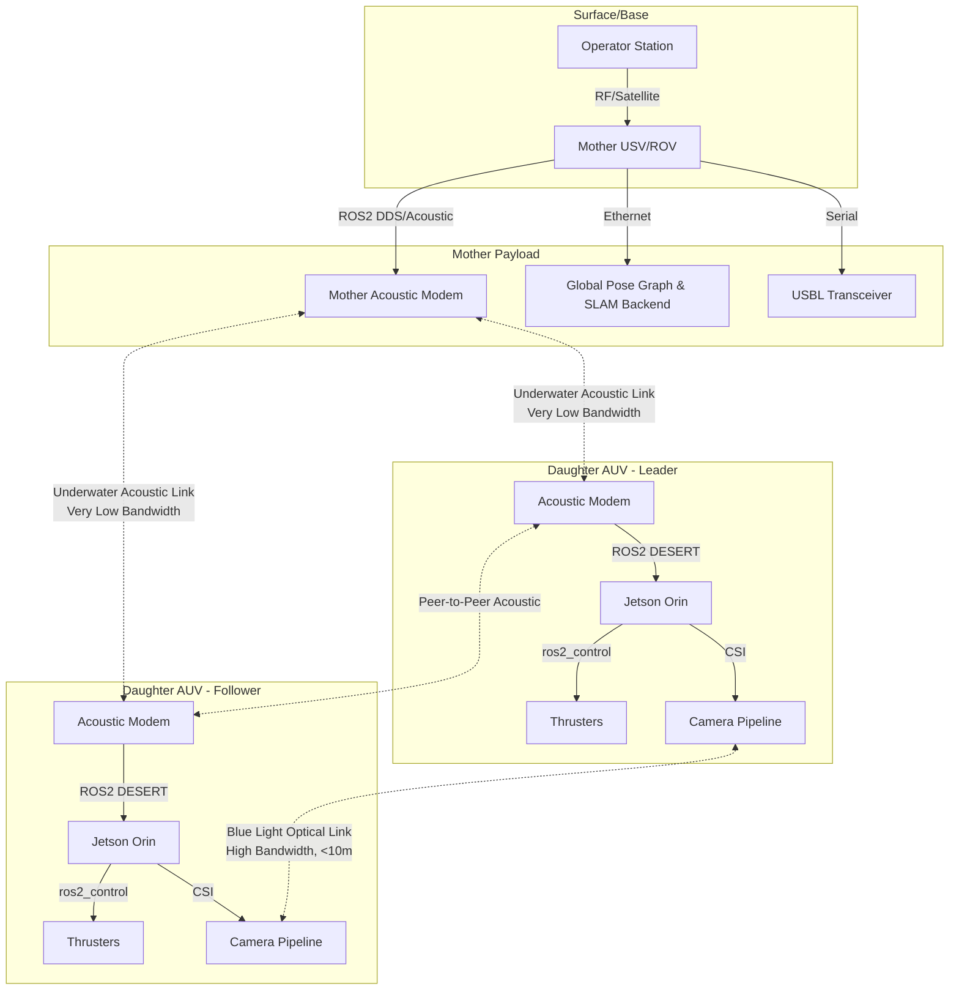

# Architecture & Systems Design

This document details the network, hardware, and ROS 2 middleware architecture required to deploy the LEGION Mother-Daughter swarm.

See [README.md](file:///c:/Code/AquaCLR/docs/legion/README.md) for the documentation index.

## 1. The Mother-Daughter Topology

The hierarchical swarm solves the most fundamental underwater robotics problem: **Communication bandwidth vs. Autonomy**.

### Mother Node (USV or Tethered Heavy ROV)
- **Role:** Global coordinator, mapping backend, and surface gateway.
- **Hardware:** High-compute x86 server (e.g., Intel NUC + NVIDIA RTX 4070), USBL (Ultra-Short Baseline) transceiver.
- **Power:** Tethered to surface or solar/generator powered (if USV).
- **Communication (Up):** Starlink / RF radio to Operator.
- **Communication (Down):** Acoustic modem broadcasting to Daughters.

### Daughter Nodes (Autonomous Micro-ROVs / AUVs)
- **Role:** Edge perception, manipulation, formation flying.
- **Hardware:** NVIDIA Jetson Orin Nano/NX, DVL (Doppler Velocity Log), localized Sonar/Camera.
- **Power:** Onboard Li-Ion batteries.
- **Communication:** Acoustic modem (low bandwidth), Optical modem (high bandwidth, short range).

---

## 2. System Architecture Diagram

---

## 3. ROS 2 Middleware Integration

ROS 2 (Jazzy/Humble) is strictly required over ROS 1 because of the **DDS (Data Distribution Service)**. DDS allows for true decentralized peer-to-peer communication, meaning if the Mother dies, the Daughters can still communicate via acoustic mesh networks.

### 3.1 Underwater Acoustic Middleware
Standard ROS 2 TCP/UDP packets are too large for acoustic modems (which often cap at 1-10 kbps).
- **Solution:** Use **DESERT Underwater** or similar acoustic bridging middleware. 
- **Mechanism:** DESERT intercepts specific ROS 2 topics (like `/daughter_1/pose`), compresses them into raw byte streams, sends them via the acoustic modem hardware, and decompresses them back into ROS 2 topics on the receiving sub.

### 3.2 Agentic Node Structure (UROSA style)
On each Daughter, computation is separated into specialized ROS 2 nodes:
1. **Perception Node:** Runs AquaCLR + YOLOv8. Subscribes `/camera/image_raw`, publishes `/camera/image_desnowed` and `/detections`.
2. **State Estimation Node:** Fuses DVL + IMU + Depth Sensor via an Extended Kalman Filter (EKF) using the `robot_localization` package.
3. **Behavior/Swarm Node:** Uses packages like `ROS2swarm` to calculate virtual-structure formation vectors.
4. **Control Node:** `ros2_control` ingests velocity commands (`cmd_vel`) and executes thruster allocation matrices.

## 4. Fault Tolerance
- **Lost Comms (Daughter):** If acoustic pinging to Mother drops for > 30 seconds, the Daughter enters `Safing Mode`, rises to 5m depth, and attempts to reacquire via optical or acoustic means.
- **Battery Low (Daughter):** Daughter requests permission to dock. Mother vectors the Daughter to an underwater docking station using short-range optical LED beacons.
