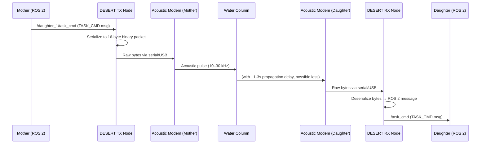

# Communications Protocol Specification

This document specifies the exact message formats, bandwidth budgets, QoS profiles, and middleware configurations required for the LEGION Mother-Daughter acoustic and optical communication links.

See [README.md](README.md) for the documentation index.

---

## 1. Physical Link Constraints

### 1.1 Acoustic Modem (Long-Range, Low Bandwidth)

Acoustic modems are the backbone of deep-water LEGION communication. Their fundamental limitations must drive every protocol design decision.

| Parameter | Typical Value | Notes |
|---|---|---|
| Max Bandwidth | 1–10 kbps | Highly dependent on range and water column |
| Latency (1-way) | 0.5–5 s | Dependent on distance; ~1500 m/s sound speed |
| Range | 2–5 km (horizontal) | Less in shallow / thermocline environments |
| Packet Loss Rate | 10–30% | Must assume lossy; ARQ required for critical msgs |
| Max Packet Size | 256–2048 bytes | Varies by modem (e.g., EvoLogics S2CR, LinkQuest) |
| Frequency Band | 10–30 kHz | Higher frequency → shorter range + higher BW |

**Key implication:** A standard ROS 2 `nav_msgs/Odometry` message serialized via CDR is ~400+ bytes. At 2 kbps, sending one message takes ~1.6 seconds. Standard DDS frequency (10–50 Hz) is physically impossible. The protocol must compress aggressively.

### 1.2 Optical Modem (Short-Range, High Bandwidth)

Blue-green laser or LED-based optical modems provide a high-bandwidth supplement for close-proximity operations (docking, cooperative inspection).

| Parameter | Typical Value | Notes |
|---|---|---|
| Max Bandwidth | 1–10 Mbps | Semi-omnidirectional LED; up to 10 Gbps for laser |
| Latency | < 1 ms | Negligible at short range |
| Range | 5–30 m | Optical absorption; turbidity degrades range |
| Packet Loss Rate | < 1% | In clear water; degrades sharply in turbid conditions |

**Key implication:** Optical modems allow full ROS 2 DDS traffic at short range. Use them for transferring map keyframes, camera frames, and software updates during docking.

---

## 2. Message Protocol Design

### 2.1 Acoustic Message Taxonomy

Messages are classified by priority and frequency. Higher-priority messages may preempt lower-priority ones in the acoustic modem's transmission queue.

| Priority | Class | Max Freq | Byte Budget | Content |
|---|---|---|---|---|
| **P0 — Critical** | `SAFING_CMD` | Event-driven | 4 bytes | Emergency surface / abort command |
| **P1 — Safety** | `HEARTBEAT` | 0.1 Hz | 8 bytes | Alive flag + battery % + error flags |
| **P2 — Nav** | `POSE_COMPRESSED` | 0.5 Hz | 24 bytes | Position + orientation (quantized) |
| **P3 — Task** | `TASK_CMD` | 0.2 Hz | 16 bytes | Waypoint + behavior ID |
| **P4 — Science** | `MAP_KEYFRAME` | On request | ≤ 512 bytes | Compressed landmark IDs for SLAM merge |

**Total average bandwidth** (P0–P3): ~60 bytes/sec × 8 = ~480 bps. This leaves comfortable headroom within a 2 kbps link and budget for retransmissions.

### 2.2 Byte Layout Specifications

All acoustic packets are big-endian binary with a 3-byte header.

#### HEARTBEAT (8 bytes)

```
Offset  Size  Type    Field
0       1     uint8   msg_type = 0x01
1       1     uint8   daughter_id  (0–15)
2       1     uint8   flags        [bit0: alive, bit1: low_batt, bit2: safing_mode, bit3: docked]
3       1     uint8   battery_pct  (0–100)
4       2     int16   depth_dm     (depth in decimetres, signed; e.g. 150 = 15.0 m)
6       2     uint16  seq          (rolling counter for loss detection)
```

#### POSE_COMPRESSED (24 bytes)

Positions are fixed-point with 1 cm resolution. Orientation uses a compressed quaternion (smallest-3) encoding.

```
Offset  Size  Type    Field
0       1     uint8   msg_type = 0x02
1       1     uint8   daughter_id
2       2     uint16  seq
4       3     int24   pos_x_cm     (±83 km range at 1 cm resolution)
7       3     int24   pos_y_cm
10      3     int24   pos_z_cm     (positive down)
13      1     uint8   quat_largest_idx  (index of the largest component, 0–3)
14      2     int16   quat_a       (Q15 fixed-point, value / 32767 → float in [-1, 1])
16      2     int16   quat_b
18      2     int16   quat_c
20      4     uint32  stamp_s      (Unix epoch seconds)
```

To decode quaternion: reconstruct the 4th component via $q_w^2 = 1 - q_a^2 - q_b^2 - q_c^2$, then swap into the correct position indicated by `quat_largest_idx`.

#### TASK_CMD (16 bytes)

```
Offset  Size  Type    Field
0       1     uint8   msg_type = 0x03
1       1     uint8   target_daughter_id  (0xFF = broadcast)
2       1     uint8   behavior_id  (see Behavior Registry below)
3       1     uint8   flags
4       3     int24   wp_x_cm      (target waypoint)
7       3     int24   wp_y_cm
10      3     int24   wp_z_cm
13      3     uint24  timeout_s    (command expiry; 0 = no timeout)
```

#### Behavior Registry

| ID | Name | Description |
|---|---|---|
| `0x00` | `IDLE` | Hold position |
| `0x01` | `GOTO_WAYPOINT` | Navigate to `wp_{x,y,z}` |
| `0x02` | `SURFACE` | Ascend to z = 0 and hold |
| `0x03` | `DOCK` | Approach docking station beacon |
| `0x04` | `FORMATION_HOLD` | Maintain current formation offset |
| `0x05` | `INSPECT` | Circle current position at 1 m radius |
| `0xFE` | `SAFING_MODE` | Emergency safing (override everything) |
| `0xFF` | `ABORT` | Kill thrusters, emergency ascent |

---

## 3. ROS 2 DDS QoS Profile Configuration

Standard DDS profiles assume reliable, low-latency LANs. For acoustic links, use these overrides. Place these in a `qos_overrides.yaml` file loaded by each node:

```yaml
# qos_overrides.yaml — Acoustic-appropriate QoS profiles for LEGION swarm nodes

# Profile for infrequent, loss-tolerant state updates (HEARTBEAT, POSE)
acoustic_state:
  reliability: BEST_EFFORT     # Don't retry; a stale pose is worse than none
  durability: VOLATILE         # No late-joiner history needed
  history: KEEP_LAST
  depth: 1                     # Only care about the most recent message
  deadline:
    period: { sec: 10, nanosec: 0 }  # Warn if no message for 10 s
  liveliness:
    kind: AUTOMATIC
    lease_duration: { sec: 30, nanosec: 0 }

# Profile for critical commands (TASK_CMD, SAFING_CMD) — must be reliable
acoustic_command:
  reliability: RELIABLE
  durability: TRANSIENT_LOCAL  # Republish to late-joiners (Daughters that just woke up)
  history: KEEP_LAST
  depth: 5
  deadline:
    period: { sec: 60, nanosec: 0 }

# Profile for high-bandwidth optical-link topics (map keyframes, image transfers)
optical_bulk:
  reliability: RELIABLE
  durability: VOLATILE
  history: KEEP_LAST
  depth: 10
  deadline:
    period: { sec: 2, nanosec: 0 }
```

Apply to a subscriber in Python:

```python
from rclpy.qos import QoSProfile, ReliabilityPolicy, DurabilityPolicy, HistoryPolicy
from rclpy.duration import Duration

ACOUSTIC_STATE_QOS = QoSProfile(
    reliability=ReliabilityPolicy.BEST_EFFORT,
    durability=DurabilityPolicy.VOLATILE,
    history=HistoryPolicy.KEEP_LAST,
    depth=1,
    deadline=Duration(seconds=10),
)
```

---

## 4. DESERT Underwater Integration

DESERT Underwater acts as a transparent acoustic bridge between ROS 2 topics and the physical acoustic modem hardware.

### 4.1 How It Works



### 4.2 DESERT Node Configuration (Excerpt)

```tcl
# desert_config.tcl — Acoustic modem bridge for Daughter AUV
Module/UW/CBR set debug_ 0
Module/UW/CBR set packetSize_ 24

# Priority queue: P0/P1 always bypass queued packets
Module/UW/PACKER/POSE create packer_pose
packer_pose addLayer Module/UW/CBR
packer_pose addLayer "POSE_COMPRESSED"

# Serial port binding for EvoLogics modem
Module/UW/MODEM/EvoLogics/S2CR set addr_ 1        ;# Daughter ID = 1
Module/UW/MODEM/EvoLogics/S2CR set portname_ "/dev/ttyUSB0"
Module/UW/MODEM/EvoLogics/S2CR set baud_ 115200
```

---

## 5. Packet Loss Handling and ARQ Strategy

### 5.1 Best-Effort vs. Reliable Selection Criteria

| Message | Strategy | Rationale |
|---|---|---|
| `HEARTBEAT` | Best-Effort | Stale heartbeat is meaningless; next packet arrives soon |
| `POSE_COMPRESSED` | Best-Effort | SLAM tolerates dropped measurements via EKF covariance propagation |
| `TASK_CMD` | STOP-AND-WAIT ARQ | Missed waypoint command could cause collision or mission failure |
| `SAFING_CMD` | Repeated broadcast (3×) | Zero-latency requirements; ACK response too slow |
| `MAP_KEYFRAME` | Sliding Window ARQ | Large payload; must be intact for pose-graph merging |

### 5.2 Safing Command Redundancy

Because a `SAFING_CMD` must survive even a 30% packet-loss rate, the Mother transmits it three times in rapid succession (100 ms apart) with no ACK required. The Daughter deduplicates using the `seq` field:

```python
class SafingCmdHandler:
    def __init__(self):
        self._seen_seqs: set[int] = set()

    def handle(self, seq: int) -> bool:
        """Return True if this is the first time we've seen this sequence number."""
        if seq in self._seen_seqs:
            return False  # Duplicate — ignore
        self._seen_seqs.add(seq)
        # Trim old sequence numbers to prevent memory growth
        if len(self._seen_seqs) > 64:
            self._seen_seqs.pop()
        return True
```

---

## 6. Clock Synchronization

Underwater vehicles cannot use NTP or PTP over acoustic links (too high latency). The following strategy is used:

1. **At surface / pre-dive:** All Daughters sync via NTP/GPS over Wi-Fi.
2. **Underwater:** Each HEARTBEAT carries a `stamp_s` (Unix timestamp from the sender's internal clock). Receivers use one-way timestamps with known sound propagation speed to estimate and correct clock skew.
3. **EKF Timestamp Injection:** The `robot_localization` EKF stamps each sensor reading with the corrected, synchronized time to prevent state estimation artifacts from clock drift.

**Expected drift:** < 100 ms per hour of dive with a quality TCXO oscillator on the Jetson carrier board.
