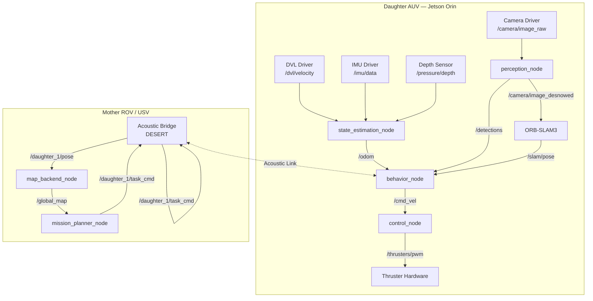
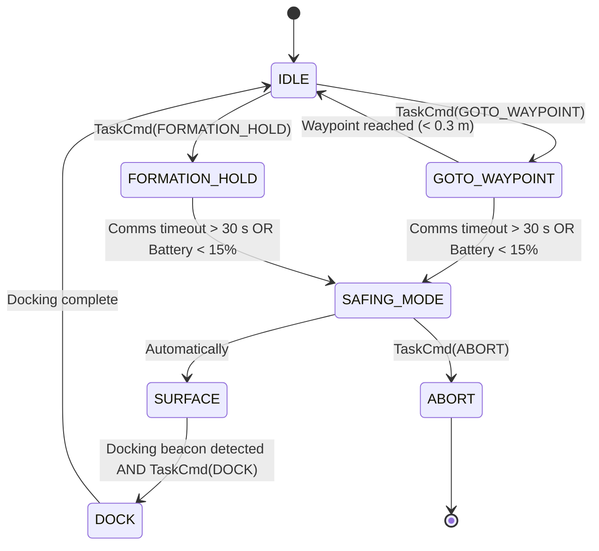

# ROS 2 Node Implementation Reference

Detailed implementation reference for every ROS 2 node in the LEGION swarm stack. Each section covers the node's responsibilities, full topic/service/action schemas, QoS profiles, internal architecture, and annotated code skeletons.

See [README.md](README.md) for the documentation index.

---

## 1. Node Graph Overview



---

## 2. `perception_node`

### 2.1 Purpose

Runs AquaCLR (TensorRT) on raw camera frames. Publishes a de-snowed, contrast-restored image alongside depth uncertainty metadata used downstream by SLAM and behavior planning.

### 2.2 Topic Schema

| Direction | Topic | Type | QoS | Rate |
|---|---|---|---|---|
| Subscribe | `/camera/image_raw` | `sensor_msgs/Image` | `SENSOR_DATA` (best-effort, depth=5) | Camera FPS (~30) |
| Subscribe | `/camera/camera_info` | `sensor_msgs/CameraInfo` | `SENSOR_DATA` | Camera FPS |
| Publish | `/camera/image_desnowed` | `sensor_msgs/Image` | `SENSOR_DATA` | Camera FPS |
| Publish | `/legion/depth_map` | `sensor_msgs/Image` (32FC1) | `SENSOR_DATA` | Camera FPS |
| Publish | `/legion/water_params` | `std_msgs/Float32MultiArray` | Best-effort, depth=1 | 1 Hz |
| Publish | `/diagnostics` | `diagnostic_msgs/DiagnosticArray` | Reliable, depth=10 | 1 Hz |

`/legion/water_params` layout: `[beta_d_r, beta_d_g, beta_d_b, beta_b_r, beta_b_g, beta_b_b, b_inf_r, b_inf_g, b_inf_b]` — the 9 Sea-Thru physical parameters predicted by the network.

### 2.3 Parameters

| Parameter | Type | Default | Description |
|---|---|---|---|
| `engine_path` | `string` | `"models/legion_desnow_s.engine"` | Path to TensorRT `.engine` file |
| `input_width` | `int` | `384` | Engine input width (must match export config) |
| `input_height` | `int` | `384` | Engine input height |
| `publish_depth` | `bool` | `true` | Whether to publish the depth map topic |
| `fp16` | `bool` | `true` | Use FP16 precision in TRT runtime |
| `warmup_iters` | `int` | `5` | GPU warmup iterations on node startup |

### 2.4 Implementation Skeleton

```python
import rclpy
from rclpy.node import Node
from rclpy.qos import qos_profile_sensor_data
from sensor_msgs.msg import Image
from std_msgs.msg import Float32MultiArray
from cv_bridge import CvBridge
import numpy as np

# Assumes TensorRT Python bindings (tensorrt, pycuda) are installed
# See docs/DEPLOYMENT_FEDORA.md for installation instructions.

class PerceptionNode(Node):
    def __init__(self):
        super().__init__("perception_node")
        self._declare_and_get_params()
        self._bridge = CvBridge()
        self._engine = self._load_trt_engine(self.get_parameter("engine_path").value)
        self._allocate_buffers()

        self.sub = self.create_subscription(
            Image,
            "/camera/image_raw",
            self._on_image,
            qos_profile_sensor_data,
        )
        self.pub_clean = self.create_publisher(Image, "/camera/image_desnowed", qos_profile_sensor_data)
        self.pub_depth = self.create_publisher(Image, "/legion/depth_map", qos_profile_sensor_data)
        self.pub_params = self.create_publisher(Float32MultiArray, "/legion/water_params", 1)

        # Publish water params at 1 Hz (they change slowly)
        self._latest_params: np.ndarray | None = None
        self.create_timer(1.0, self._publish_water_params)

    def _on_image(self, msg: Image) -> None:
        frame = self._bridge.imgmsg_to_cv2(msg, desired_encoding="rgb8")
        frame_f32 = frame.astype(np.float32) / 255.0  # Normalize to [0, 1]

        # Run TensorRT inference (engine I/O is pre-allocated in _allocate_buffers)
        j, z, params = self._run_inference(frame_f32)

        self.pub_clean.publish(
            self._bridge.cv2_to_imgmsg((j * 255).astype(np.uint8), encoding="rgb8")
        )
        self.pub_depth.publish(
            self._bridge.cv2_to_imgmsg(z.squeeze(), encoding="32FC1")
        )
        self._latest_params = params  # Deferred to 1 Hz timer

    def _publish_water_params(self) -> None:
        if self._latest_params is None:
            return
        msg = Float32MultiArray()
        msg.data = self._latest_params.tolist()
        self.pub_params.publish(msg)

    def _load_trt_engine(self, path: str):
        import tensorrt as trt
        logger = trt.Logger(trt.Logger.WARNING)
        with open(path, "rb") as f, trt.Runtime(logger) as runtime:
            return runtime.deserialize_cuda_engine(f.read())

    def _allocate_buffers(self):
        # Pre-allocate pinned host memory and device memory for zero-copy transfers
        import pycuda.driver as cuda
        self._stream = cuda.Stream()
        # ... (full buffer allocation omitted for brevity — see inference/inference_trt.py)

    def _run_inference(self, frame: np.ndarray) -> tuple[np.ndarray, np.ndarray, np.ndarray]:
        # ... copy to device, execute, copy back
        raise NotImplementedError("Wire up to aquaclr.inference.inference_trt")

    def _declare_and_get_params(self):
        self.declare_parameter("engine_path", "models/legion_desnow_s.engine")
        self.declare_parameter("input_width", 384)
        self.declare_parameter("input_height", 384)
        self.declare_parameter("publish_depth", True)
        self.declare_parameter("fp16", True)
        self.declare_parameter("warmup_iters", 5)


def main():
    rclpy.init()
    node = PerceptionNode()
    rclpy.spin(node)
    rclpy.shutdown()
```

---

## 3. `state_estimation_node`

### 3.1 Purpose

Fuses DVL velocity, IMU orientation, and pressure-sensor depth into a single smooth odometry estimate using an Extended Kalman Filter. This is the ground-truth pose reference for every other node on the Daughter.

### 3.2 Topic Schema

| Direction | Topic | Type | QoS |
|---|---|---|---|
| Subscribe | `/dvl/velocity` | `geometry_msgs/TwistWithCovarianceStamped` | Best-effort, depth=5 |
| Subscribe | `/imu/data` | `sensor_msgs/Imu` | Best-effort, depth=10 |
| Subscribe | `/pressure/depth` | `std_msgs/Float64` | Best-effort, depth=5 |
| Publish | `/odom` | `nav_msgs/Odometry` | Best-effort, depth=5, 30 Hz |
| Publish | `/tf` | `tf2_msgs/TFMessage` | Best-effort, depth=100 |

### 3.3 `robot_localization` EKF Configuration

This node is *not* custom code — it is the standard `robot_localization` package's `ekf_node`, configured via YAML:

```yaml
# ekf_daughter.yaml

ekf_filter_node:
  ros__parameters:
    frequency: 30.0          # EKF update rate (Hz)
    sensor_timeout: 0.5      # Consider sensor stale after 0.5 s
    two_d_mode: false        # Full 3D operation
    publish_tf: true
    odom_frame: odom
    base_link_frame: base_link
    world_frame: odom
    
    # DVL — provides body-frame linear velocities (vx, vy, vz)
    twist0: /dvl/velocity
    twist0_config: [false, false, false,   # X, Y, Z position — NOT from DVL
                    false, false, false,   # Roll, Pitch, Yaw — NOT from DVL
                    true,  true,  true,   # Vx, Vy, Vz — YES, DVL provides these
                    false, false, false,   # Roll rate, Pitch rate, Yaw rate
                    false, false, false]   # X accel, Y accel, Z accel
    twist0_rejection_threshold: 2.0       # Mahalanobis distance gate
    twist0_queue_size: 5

    # IMU — provides orientation and angular velocity
    imu0: /imu/data
    imu0_config: [false, false, false,
                  true,  true,  true,     # Roll, Pitch, Yaw from IMU
                  false, false, false,
                  true,  true,  true,     # Angular velocities
                  true,  true,  true]     # Linear accelerations
    imu0_remove_gravitational_acceleration: true
    imu0_queue_size: 10

    # Depth sensor — provides Z position directly
    pose0: /pressure/pose   # Adapter node converts Float64 depth to PoseWithCovStamped
    pose0_config: [false, false, true,    # Z position only
                   false, false, false,
                   false, false, false,
                   false, false, false,
                   false, false, false]
    pose0_queue_size: 5

    # Process noise covariance tuning
    process_noise_covariance: [0.05, 0, 0, 0, 0, 0, 0, 0, 0, 0, 0, 0, 0, 0, 0,
                                0, 0.05, 0, 0, 0, 0, 0, 0, 0, 0, 0, 0, 0, 0, 0,
                                0, 0, 0.06, 0, 0, 0, 0, 0, 0, 0, 0, 0, 0, 0, 0,
                                0, 0, 0, 0.03, 0, 0, 0, 0, 0, 0, 0, 0, 0, 0, 0,
                                0, 0, 0, 0, 0.03, 0, 0, 0, 0, 0, 0, 0, 0, 0, 0,
                                0, 0, 0, 0, 0, 0.06, 0, 0, 0, 0, 0, 0, 0, 0, 0,
                                0, 0, 0, 0, 0, 0, 0.025, 0, 0, 0, 0, 0, 0, 0, 0,
                                0, 0, 0, 0, 0, 0, 0, 0.025, 0, 0, 0, 0, 0, 0, 0,
                                0, 0, 0, 0, 0, 0, 0, 0, 0.04, 0, 0, 0, 0, 0, 0,
                                0, 0, 0, 0, 0, 0, 0, 0, 0, 0.01, 0, 0, 0, 0, 0,
                                0, 0, 0, 0, 0, 0, 0, 0, 0, 0, 0.01, 0, 0, 0, 0,
                                0, 0, 0, 0, 0, 0, 0, 0, 0, 0, 0, 0.02, 0, 0, 0,
                                0, 0, 0, 0, 0, 0, 0, 0, 0, 0, 0, 0, 0.01, 0, 0,
                                0, 0, 0, 0, 0, 0, 0, 0, 0, 0, 0, 0, 0, 0.01, 0,
                                0, 0, 0, 0, 0, 0, 0, 0, 0, 0, 0, 0, 0, 0, 0.015]
```

---

## 4. `behavior_node`

### 4.1 Purpose

Implements the Daughter's high-level decision-making. Receives task commands from the Mother via the acoustic bridge, monitors state from the EKF, and outputs velocity commands to the control node. Also manages formation offsets and safing mode transitions.

### 4.2 Topic Schema

| Direction | Topic | Type | QoS |
|---|---|---|---|
| Subscribe | `/odom` | `nav_msgs/Odometry` | Best-effort, depth=1 |
| Subscribe | `/slam/pose` | `geometry_msgs/PoseStamped` | Best-effort, depth=1 |
| Subscribe | `/task_cmd` | Custom `legion_msgs/TaskCmd` | Reliable (ACOUSTIC_CMD profile) |
| Subscribe | `/detections` | `vision_msgs/Detection2DArray` | Best-effort, depth=1 |
| Publish | `/cmd_vel` | `geometry_msgs/Twist` | Best-effort, depth=1 |
| Publish | `/daughter/status` | Custom `legion_msgs/DaughterStatus` | Best-effort, depth=1 |

### 4.3 Behavior State Machine



### 4.4 Safing Mode Logic

```python
COMMS_TIMEOUT_S = 30.0
LOW_BATTERY_PCT = 15

class BehaviorNode(Node):
    def __init__(self):
        super().__init__("behavior_node")
        self._last_heartbeat_from_mother = self.get_clock().now()
        self._battery_pct = 100
        self._state = "IDLE"
        self.create_timer(1.0, self._safety_watchdog)

    def _safety_watchdog(self) -> None:
        """Called at 1 Hz; checks for conditions that require safing."""
        age = (self.get_clock().now() - self._last_heartbeat_from_mother).nanoseconds * 1e-9
        if age > COMMS_TIMEOUT_S or self._battery_pct < LOW_BATTERY_PCT:
            if self._state != "SAFING_MODE":
                self.get_logger().warn(
                    f"SAFING MODE triggered: comms_age={age:.1f}s, batt={self._battery_pct}%"
                )
                self._state = "SAFING_MODE"
                self._ascend_to_surface()

    def _ascend_to_surface(self) -> None:
        from geometry_msgs.msg import Twist
        cmd = Twist()
        cmd.linear.z = -0.3  # Convention: negative Z = ascend (NED frame)
        self._cmd_vel_pub.publish(cmd)
```

---

## 5. `control_node`

### 5.1 Purpose

Converts body-frame velocity commands (`cmd_vel`) into per-thruster PWM signals using a pre-computed Thruster Allocation Matrix (TAM). Also handles motor feedback and soft limits.

### 5.2 Thruster Allocation Matrix (BlueROV2 Heavy)

The BlueROV2 Heavy configuration has 8 thrusters. The TAM $\mathbf{T}$ maps a 6-DOF wrench $\boldsymbol{\tau} = [F_x, F_y, F_z, M_x, M_y, M_z]^T$ to 8 thruster forces:

$$\mathbf{f} = \mathbf{T}^+ \boldsymbol{\tau}$$

where $\mathbf{T}^+$ is the pseudo-inverse of the configuration matrix. For the Heavy configuration:

```python
import numpy as np

# BlueROV2 Heavy — thruster geometry (positions and thrust vectors)
# Each row: [tx, ty, tz, mx, my, mz] contribution of one thruster
# (pre-computed from geometry; normalized unit vectors)
TAM = np.array([
    # Horizontal thrusters (1-4): contribute to Fx, Fy, Mz
    [ 0.707,  0.707, 0.0,  0.0,  0.0,  0.21],  # T1
    [ 0.707, -0.707, 0.0,  0.0,  0.0, -0.21],  # T2
    [-0.707,  0.707, 0.0,  0.0,  0.0,  0.21],  # T3
    [-0.707, -0.707, 0.0,  0.0,  0.0, -0.21],  # T4
    # Vertical thrusters (5-8): contribute to Fz, Mx, My
    [ 0.0,    0.0,  1.0,  0.18, -0.11, 0.0],   # T5
    [ 0.0,    0.0,  1.0, -0.18, -0.11, 0.0],   # T6
    [ 0.0,    0.0,  1.0,  0.18,  0.11, 0.0],   # T7
    [ 0.0,    0.0,  1.0, -0.18,  0.11, 0.0],   # T8
], dtype=np.float32).T  # Shape: (6, 8)

TAM_PINV = np.linalg.pinv(TAM)  # Shape: (8, 6), computed once at startup

MAX_FORCE_N = 35.0   # T200 thruster max thrust at 16V

def wrench_to_pwm(tau: np.ndarray) -> np.ndarray:
    """Map a 6-DOF wrench vector to 8 PWM values in [1100, 1900] μs."""
    forces = TAM_PINV @ tau  # Shape: (8,)
    forces_clipped = np.clip(forces, -MAX_FORCE_N, MAX_FORCE_N)
    # Linear map: -MAX_FORCE_N → 1100 μs, 0 → 1500 μs, +MAX_FORCE_N → 1900 μs
    pwm = 1500 + (forces_clipped / MAX_FORCE_N) * 400
    return pwm.astype(int)
```

### 5.3 Velocity PID Controllers

`cmd_vel` carries desired body-frame velocities. The control node runs six independent PID controllers (one per DOF) to convert these into force setpoints $\boldsymbol{\tau}$:

```python
from simple_pid import PID  # pip install simple-pid

class ControlNode(Node):
    def __init__(self):
        super().__init__("control_node")
        # Tuned gains for BlueROV2 Heavy at ~10 kg total displacement
        self._pids = {
            "vx": PID(Kp=20.0, Ki=2.0, Kd=0.5, setpoint=0.0, output_limits=(-35, 35)),
            "vy": PID(Kp=20.0, Ki=2.0, Kd=0.5, setpoint=0.0, output_limits=(-35, 35)),
            "vz": PID(Kp=30.0, Ki=5.0, Kd=1.0, setpoint=0.0, output_limits=(-35, 35)),
            "wx": PID(Kp=10.0, Ki=1.0, Kd=0.2, setpoint=0.0, output_limits=(-10, 10)),
            "wy": PID(Kp=10.0, Ki=1.0, Kd=0.2, setpoint=0.0, output_limits=(-10, 10)),
            "wz": PID(Kp=15.0, Ki=2.0, Kd=0.3, setpoint=0.0, output_limits=(-10, 10)),
        }
```

---

## 6. `map_backend_node` (Mother Node)

### 6.1 Purpose

Runs on the Mother. Receives compressed pose estimates from all Daughters over the acoustic bridge and feeds them into a global GTSAM pose-graph optimizer. Detects loop closures between Daughter maps and publishes a globally-consistent merged map.

### 6.2 Topic Schema (Mother Side)

| Direction | Topic | Type | Notes |
|---|---|---|---|
| Subscribe | `/daughter_+/pose_compressed` | Custom `legion_msgs/PoseCompressed` | One per Daughter |
| Subscribe | `/daughter_+/keyframe` | Custom `legion_msgs/MapKeyframe` | Over optical link during docking |
| Publish | `/global_map/pose_graph` | `visualization_msgs/MarkerArray` | For operator display |
| Publish | `/daughter_+/task_cmd` | Custom `legion_msgs/TaskCmd` | Mission commands to each Daughter |
| Publish | `/mission/status` | `std_msgs/String` | JSON status for topside dashboard |

### 6.3 GTSAM Integration Sketch

```python
import gtsam
from gtsam import symbol_shorthand as S

# Symbol convention: D(id, time_step) for Daughter poses
D = S.D  # Daughter poses in GTSAM factor graph

class MapBackendNode(Node):
    def __init__(self):
        super().__init__("map_backend_node")
        self._graph = gtsam.NonlinearFactorGraph()
        self._initial_estimates = gtsam.Values()
        self._optimizer = gtsam.ISAM2(gtsam.ISAM2Params())
        self._step: dict[int, int] = {}  # daughter_id -> current step index

        # Prior on first pose of each Daughter (set at launch with GPS fix)
        prior_noise = gtsam.noiseModel.Diagonal.Sigmas([0.3, 0.3, 0.3, 0.1, 0.1, 0.1])
        for d_id in range(NUM_DAUGHTERS):
            self._step[d_id] = 0
            key = D(d_id * 1000 + 0)  # Encode daughter_id into key
            self._graph.push_back(gtsam.PriorFactorPose3(key, gtsam.Pose3(), prior_noise))
            self._initial_estimates.insert(key, gtsam.Pose3())

    def _on_pose_compressed(self, msg, daughter_id: int) -> None:
        step = self._step[daughter_id]
        prev_key = D(daughter_id * 1000 + step)
        curr_key = D(daughter_id * 1000 + step + 1)
        
        # Acoustic odometry noise model (high uncertainty for acoustic positioning)
        noise = gtsam.noiseModel.Diagonal.Sigmas([0.5, 0.5, 0.3, 0.05, 0.05, 0.1])
        delta_pose = self._decode_pose_msg(msg)
        
        self._graph.push_back(gtsam.BetweenFactorPose3(prev_key, curr_key, delta_pose, noise))
        self._initial_estimates.insert(curr_key, delta_pose)
        
        # Incremental ISAM2 update
        self._optimizer.update(self._graph, self._initial_estimates)
        self._graph.resize(0)
        self._initial_estimates.clear()
        self._step[daughter_id] += 1
```

---

## 7. Namespace and Launch Configuration

All nodes use ROS 2 namespaces to support multi-robot operation without topic collisions.

```
/mother/
    map_backend_node
    mission_planner_node
    acoustic_bridge_node

/daughter_1/
    perception_node
    state_estimation_node
    behavior_node
    control_node
    acoustic_bridge_node

/daughter_2/
    perception_node
    ...
```

Minimal launch file (`legion_daughter.launch.py`):

```python
from launch import LaunchDescription
from launch_ros.actions import Node
from launch.substitutions import LaunchConfiguration

def generate_launch_description():
    daughter_id = LaunchConfiguration("daughter_id", default="1")
    ns = ["daughter_", daughter_id]

    return LaunchDescription([
        Node(package="aquaclr_ros", executable="perception_node",    namespace=ns,
             parameters=[{"engine_path": "/opt/legion/legion_desnow_s.engine"}]),
        Node(package="robot_localization", executable="ekf_node",    namespace=ns,
             parameters=["/opt/legion/ekf_daughter.yaml"]),
        Node(package="legion_behaviors", executable="behavior_node", namespace=ns),
        Node(package="legion_control",   executable="control_node",  namespace=ns),
        Node(package="legion_comms",     executable="acoustic_bridge_node", namespace=ns,
             parameters=[{"daughter_id": daughter_id}]),
    ])
```
