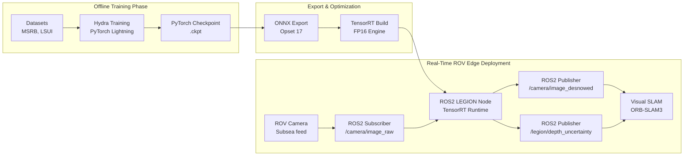
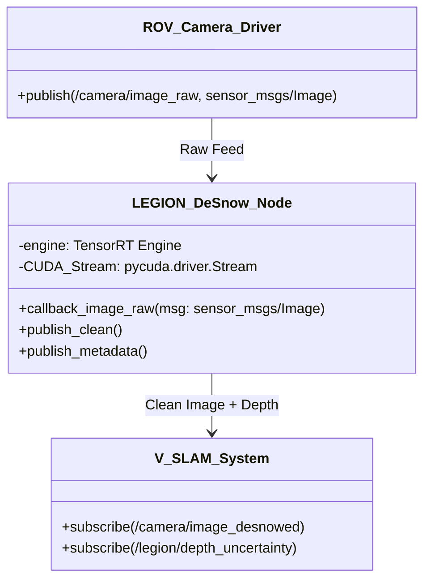

# Complete System Architecture & Future Integration Blueprint

This document provides a holistic, end-to-end architectural overview of the entire AquaCLR project. It extends beyond the core neural network to encompass data pipelines, training orchestration, real-time inference engines, and future integrations with Remotely Operated Vehicles (ROVs) via ROS2.

---

## 1. End-to-End System Pipeline Overview

The AquaCLR system is designed as a pipeline that spans from offline model training on high-performance compute clusters to real-time, low-latency deployment on edge devices embedded in underwater ROVs.

---

## 2. Training Pipeline Architecture

The training pipeline is orchestrated by **Hydra** and built upon **PyTorch Lightning**. This decoupling allows researchers to easily sweep hyperparameters and mix-and-match datasets without touching boilerplate code.

### 2.1. Data Flow during Training
1. **Dataloaders**: The system ingests the MSRB (primary marine snow) and LSUI (auxiliary depth/transmission supervision) datasets.
2. **Augmentation**: Data undergoes random cropping (e.g., 256x256 or 384x384), horizontal/vertical flipping, and color jitter to improve robustness.
3. **Forward Pass**: Images are passed through the Sea-Thru LEGION network, outputting $z, \beta_D, \beta_B, B_{inf}$.
4. **Analytic Inversion**: The physical parameters are mathematically inverted to produce the clean image $J$.
5. **Loss Computation**: The `PhysicsInformedLoss` compares $J$ to the ground truth, computes the forward physics consistency against the observed image $I$, applies Total Variation (TV) to the depth map $z$, and calculates Structural Similarity (SSIM).
6. **Optimization**: Gradients are backpropagated using AdamW with a `OneCycleLR` scheduling policy. Mixed precision (`bf16-mixed`) is utilized to accelerate training on Ampere/Ada GPUs.

### 2.2 Hardware Profiles
The configuration supports multiple hardware profiles natively:
- **RTX 3050 Profile**: Batch size 8, 256px crops, fits within 4GB VRAM.
- **RTX A3000 Profile**: Batch size 16, 384px crops, fills 6GB VRAM.

---

## 3. Real-Time Inference Dataflow

For ROV deployment, PyTorch is too heavy and slow. The inference architecture relies on exporting the trained model to highly optimized computational graphs.

1. **Export to ONNX**: The `.ckpt` is exported to a dynamic-shape ONNX graph (Opset 17).
2. **Graph Simplification**: `onnx-simplifier` optimizes redundant operations (e.g., constant folding).
3. **TensorRT Engine Build**: ONNX is ingested by NVIDIA TensorRT. The compiler fuses kernel operations (e.g., Conv2D + BatchNorm + HardSwish into a single GPU kernel) and quantizes activations to FP16.
4. **Execution**: The resulting `.engine` file runs natively on the target hardware (e.g., NVIDIA Jetson Orin), achieving <15ms latency per frame (60-100+ FPS).

---

## 4. ROS2 Architecture & ROV Integration

The ultimate goal of AquaCLR is active deployment on an ROV. The system acts as an invisible "pre-processing" middleware layer between the ROV's raw camera feed and its autonomous navigation/SLAM stack.

### 4.1 ROS2 Node Architecture
The ROS2 node (`legion_desnow_node`), compatible with **ROS2 Humble** and **Jazzy**, encapsulates the TensorRT runtime.

### 4.2 Data Topics and Latency Budget
- **Input**: Subscribes to `/camera/image_raw` (`sensor_msgs/Image`).
- **Processing**: Zero-copy memory transfers where possible. The image is passed directly to the pre-allocated GPU memory buffers for the TRT engine.
- **Output 1**: Publishes `/legion/image_desnowed` (`sensor_msgs/Image`). This feed is visually clear, free of marine snow, and geometrically stable.
- **Output 2 (Future M2 Integration)**: Publishes `/legion/depth_uncertainty` (based on the predicted physical depth $z$). This acts as a confidence map for the SLAM system. Pixels with extreme depth ($z \to \infty$) are marked as high-uncertainty, telling the SLAM feature-extractor to ignore keypoints in those regions.

### 4.3 ROV Hardware Integration Strategy
1. **Edge Compute**: The ROV requires an embedded GPU, such as an **NVIDIA Jetson Orin Nano** or **Orin NX**. 
2. **Containerization**: Deployment is managed via Docker/Distrobox. The node runs inside a Ubuntu 24.04 container with ROS2 Jazzy and the NVIDIA Container Toolkit (CDI) configured for raw hardware passthrough.
3. **Power Budget**: The `MobileNetV3` backbone was explicitly chosen because it draws less power and computes significantly faster than heavier architectures (like ResNet50 or ViT), preserving the ROV's battery life for thruster operations.

---

## 5. Future Roadmap

1. **Stereo Camera Support**: 
   - *Current*: Monocular estimation of depth ($z$).
   - *Future*: Expanding the input channel dimensions to 6 (`[left, right]`) to leverage physical disparity for perfect depth estimation.
2. **Temporal Consistency**:
   - Integrating a lightweight ConvLSTM or optical-flow alignment mechanism before the illumination head to ensure that $\beta_D, \beta_B$ and $B_{inf}$ do not flicker rapidly between frames.
3. **Closed-Loop Illumination Control**:
   - If the ROV has variable-intensity strobe lights, the network's prediction of $B_{inf}$ (ambient veiling light) and backscatter severity ($\beta_B$) can be published back to the ROV's hardware controller. If backscatter is extremely high, the ROV can autonomously dim its strobes to reduce the glare.
